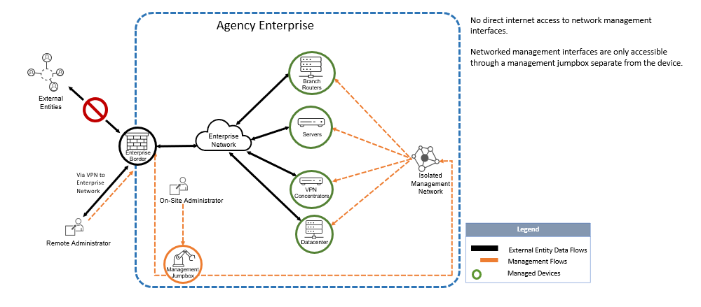

# Mitigating Risk from Internet-Exposed Management Interfaces - 20230615001

## Overview

Threat actor trends over recent months have renewed the importance of securing internet-exposed management interfaces to better protect organisations networks. Devices using these interfaces are highly exposed, targeted and often plagued by inadequate security, misconfigurations, and out of date software making them more vulnerable to exploitation. Most device management interfaces are designed to be accessed from dedicated physical interfaces and/or management networks and are not meant to be accessible directly from the public internet.

## Scope

In the context of this advisory, device management interfaces can be defined as a dedicated device interface that is accessible over network protocols and is meant exclusively for authorized users to perform administrative activities on a device, a group of devices, or the network itself.

Examples of some of the devices that can use these interfaces are proxies, firewalls, iLo/iDRAC and routers. Typically they include any device for which management interfaces are using the following network protocols:

- HTTP, HTTPS, FTP, SNMP, Telnet, TFTP, RDP, rlogin, RSH, SSH, SMB, VNC, X11

## Recommendation

The WA SOC requests WA agencies undertake the following recommendations to address these concerns:

- Remove device management interfaces from the internet by making it only accessible from an internal enterprise network (Ideally an isolated management network); and/or
- Deploy capabilities, as part of a Zero Trust Architecture, that enforce access control to the interface through a policy enforcement point separate from the interface itself (preferred action).

**Example of a network that adheres to recommendation:**

Additional references listed below can give further information and context to the above advisory. WA SOC will reach out to agencies if these management interfaces are detected on the internet to help address cybersecurity risk.

## Additional References

- [ACSC - Fortinet Fortigate Vulnerability](https://www.cyber.gov.au/about-us/view-all-content/alerts-and-advisories/critical-severity-vulnerability-fortinet-fortigate-ssl-vpn-devices)
- [CISA - Binding Operational Directive 23-02 Implementation Guidance](https://www.cisa.gov/news-events/directives/binding-operational-directive-23-02-implementation-guidance)
- [NCSC - Zero Trust Architecture](https://www.ncsc.gov.uk/blog-post/zero-trust-architecture-design-principles)
