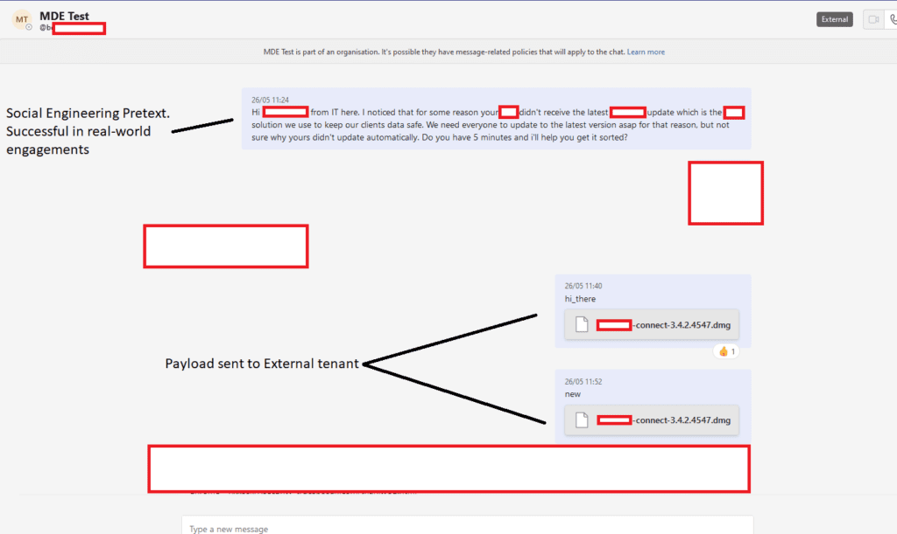

# Microsoft Teams Vulnerability Allows External Sources to Send Files to Employees - 20230630003

## Overview

Recent [research by JUMPSEC](https://labs.jumpsec.com/advisory-idor-in-microsoft-teams-allows-for-external-tenants-to-introduce-malware/) shows Microsoft Teams allows Sharepoint links to appear as *files* in messages from external sources, this allows attackers to reach out direct to employees and potentially bypass the controls that organisations have in place from typical email malware phishing attempts.

## What is the vulnerability?

- Potential Malware Delivery Vector - There is no CVE for this issue, Microsoft has acknowledged it exists but ‘did not meet the bar for immediate servicing’.

**Example Malware Delivery via External Teams:**

## What is vulnerable?

The vulnerability affects all business versions of Microsoft Teams.

## What has been observed?

There is no evidence of exploitation affecting Western Australian Government networks at the time of publishing.

## Recommendation

The WA SOC recommends administrators deny external tenant communication in Microsoft Teams via the Microsoft365 Admin Portal, or restrict it to specific domains if it is a requirement for normal operations.

## Additional references

- [**JUMPSEC Labs Teams Research**](https://labs.jumpsec.com/advisory-idor-in-microsoft-teams-allows-for-external-tenants-to-introduce-malware/)
- [**DarkReading - Microsoft Teams Attack Skips the Phish to Deliver Malware Directly**](https://www.darkreading.com/vulnerabilities-threats/microsoft-teams-attack-phish-deliver-malware-directly)
