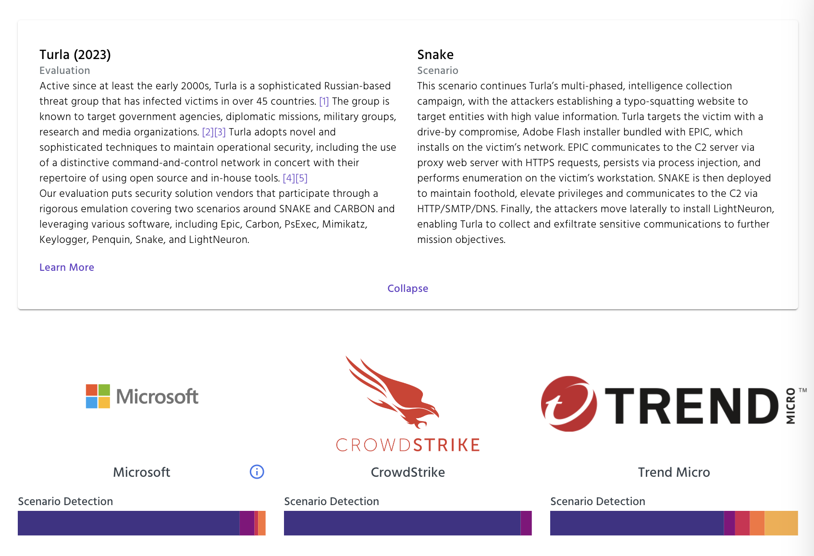
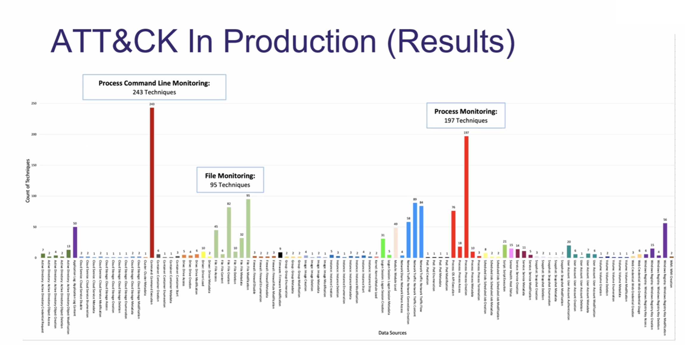

# Baseline for Detection Coverage (MITRE ATT&CK)

This document and associated checklist is intended to be used as a high-level self assessment against an organisations *[telemetry collection](https://attack.mitre.org/datasources/)* and *[detection analytics](https://attack.mitre.org)* aligned to the [MITRE ATT&CK Framework](https://attack.mitre.org).

<iframe width="560" height="315" src="https://www.youtube-nocookie.com/embed/uEkoLXpHoBE?si=xrEk4k4cUcDKlLrB" title="YouTube video player" frameborder="0" allow="accelerometer; autoplay; clipboard-write; encrypted-media; gyroscope; picture-in-picture; web-share" allowfullscreen></iframe>

## 1. Shared Responsibility Model

For service providers see Supply Chain Risk Management(vendors should report detection coverage monthly and incidents within 24 hours). Otherwise ensure the [Security Operations](../baselines/security-operations.md) team is resourced to collect the below telemetry and manage detection, triage and response activities over them based on the organisations risk profile.

## 2. Data Sources

Below are the highest priority MITRE Data Sources to ensure telemetry and analytics are available for:

1. [DS0002 User Account](https://attack.mitre.org/datasources/DS0002/) - A profile representing a user, device, service, or application used to authenticate and access resources
1. [DS0025 Cloud Service](https://attack.mitre.org/datasources/DS0025/) - Infrastructure, platforms, or software that are hosted on-premise or by third-party providers, made available to users through network connections and/or APIs
1. [DS0009 Process](https://attack.mitre.org/datasources/DS0009/) - Instances of computer programs that are being executed by at least one thread. Processes have memory space for process executables, loaded modules (DLLs or shared libraries), and allocated memory regions containing everything from user input to application-specific data structures
1. [DS0017 Command](https://attack.mitre.org/datasources/DS0017/) - A directive given to a computer program, acting as an interpreter of some kind, in order to perform a specific task
1. [DS0022 File](https://attack.mitre.org/datasources/DS0022/) - A computer resource object, managed by the I/O system, for storing data (such as images, text, videos, computer programs, or any wide variety of other media).
1. [DS0029 Network Traffic](https://attack.mitre.org/datasources/DS0029/) - Data transmitted across a network (ex: Web, DNS, Mail, File, etc.), that is either summarized (ex: Netflow) and/or captured as raw data in an analyzable format (ex: PCAP)
1. [DS0015 Application Log](https://attack.mitre.org/datasources/DS0015/) - Events collected by third-party services such as mail servers, web applications, or other appliances (not by the native OS or platform)

### 2.1 Telemetry Sensors

Based on these data sources telemetry sensor deployment can be prioritised as follows:

1. [Endpoints and Servers via XDR platforms](#22-xdr-detection-and-response-platforms)
1. [Network via network analytics platforms](https://soc.cyber.wa.gov.au/guidelines/network-management/#adverse-event-analysis-and-asset-inventory)
1. [Public / Private cloud via API or native platforms](../guidelines/secure-configuration.md)

### 2.2 XDR (Detection and Response) platforms

XDR platforms are regularly [evaluated by MITRE Engenuity (ref: Turla (2023))](https://attackevals.mitre-engenuity.org/results/enterprise?vendor=microsoft&vendor=crowdstrike&vendor=trendmicro&evaluation=turla&scenario=2). Please carefully consider Supply Chain Risk when selecting such platforms - constrain to independently assessed platforms hosted in Australia, such as [Microsoft Defender XDR](https://learn.microsoft.com/en-us/microsoft-365/security/defender/eval-overview?view=o365-worldwide) or [Trend Vision One](https://www.trendmicro.com/en_au/business/technologies/regional-data-centers.html).

Self managed platforms like [Wazuh](https://wazuh.com) (a SIEM platform that also [inventories vulnerabilities](https://documentation.wazuh.com/current/user-manual/capabilities/vulnerability-detection/how-it-works.html), measures [CIS Benchmarks](https://documentation.wazuh.com/current/user-manual/capabilities/policy-monitoring/ciscat/ciscat.html) and [NIST 800-53 Compliance](https://documentation.wazuh.com/current/compliance/nist/index.html)) are effective for internally capable teams or training purposes (below excellent vid by [John Hammond](https://www.youtube.com/johnhammond010)):

<iframe width="560" height="315" src="https://www.youtube-nocookie.com/embed/i68atPbB8uQ?si=x-Z7fleGVr-BCII6" title="YouTube video player" frameborder="0" allow="accelerometer; autoplay; clipboard-write; encrypted-media; gyroscope; picture-in-picture; web-share" allowfullscreen></iframe>

## 3. Detection Assets

The below is a high level summary of assets and services from where security logs should typically be collected. Subsequent detection queries will refer to these assets.

- **Users** - Identity Services (On Premise and SaaS), Application access
- **Mailboxes** - Email mailboxes and associated inbound/outbound flows
- **Endpoints** - Devices that users utilise to access organisational resources
- **Servers** - Hypervisors, Servers, Container Platforms
- **Network Firewalls (Firewalls)** - Network egress and internal network control points
- **Web Application Firewalls (WAFs)** - Network ingress control points
- **Applications and Databases** - Application logs and query logs from application runtimes (e.g. stack traces) and databases

## 4. Detection Checklist

The below checklist should be undertaken by the organisations security team to calculate the percentage coverage of assets (e.g. 8 / 10 Endpoints == 80% coverage) for a given log retention window (normally 12 months). This data is heavily used for threat hunting activities.

### 4.1. Excellent return on investment

These are available as out of the box integrations on fully SaaS platforms such as [Microsoft Sentinel connected to Microsoft 365 Defender via Microsoft XDR](https://learn.microsoft.com/en-us/azure/sentinel/connect-microsoft-365-defender?tabs=MDE). On-Prem sign-ins depending on the [Defender for Identity](https://learn.microsoft.com/en-us/defender-for-identity/capacity-planning) require sensor deployment on all Domain Controllers (minimum version Windows Server 2012).

- [ ] **Users** - Query a `IPv4Address`, `IPv6Address`, `Protocol` or `User-Agent (HTTPRequestExt)` across all [Network Traffic](https://attack.mitre.org/datasources/DS0029/) for HTTPS sign ins.
    - E.g. [Sign-in logs in Azure Active Directory](https://learn.microsoft.com/en-us/azure/active-directory/reports-monitoring/concept-all-sign-ins).
- [ ] **Users** - Query a `IPv4Address`, `IPv6Address` or `Protocol` across all [Network Traffic](https://attack.mitre.org/datasources/DS0029/) for On-Prem sign ins.
    - E.g. [Defender for Identity](https://learn.microsoft.com/en-us/defender-for-identity/architecture).
- [ ] **Mailboxes** - Email events and URL / attachment analysis using mail server [Application Logs](https://attack.mitre.org/datasources/DS0015/).
    - E.g. [Defender for Office 365](https://learn.microsoft.com/en-us/microsoft-365/security/office-365-security/defender-for-office-365?view=o365-worldwide#microsoft-defender-for-office-365-plan-1-and-plan-2)
    - [ ] Query a `DomainName` or `EmailAddress` across all emails.
    - [ ] Query a `Subject (EmailMessage)` across all emails.
    - [ ] Query a `DomainName` or `URL` across all links inside emails.
    - [ ] Query a `SHA256 Hash (File)` across all attachments inside emails.

### 4.2. Very high return on investment

These are available as integrations with some deployment requirements on Windows, macOs and Linux endpoints using [Microsoft Defender for Endpoint](https://learn.microsoft.com/en-us/microsoft-365/security/defender-endpoint/microsoft-defender-endpoint?view=o365-worldwide).

- [ ] **Endpoints** - Query a `IPv4Address`, `IPv6Address`, `DomainName` or `URL` across all outbound [Network Traffic](https://attack.mitre.org/datasources/DS0029/).
    - E.g. [Defender Network Protection](https://learn.microsoft.com/en-us/microsoft-365/security/defender-endpoint/network-protection?view=o365-worldwide), [Defender Web Protection](https://learn.microsoft.com/en-us/microsoft-365/security/defender-endpoint/web-protection-overview?view=o365-worldwide)
- [ ] **Endpoints** - Query a `SHA256 Hash (File)`, `Name (File)` or `FileOriginUrl (File)` across all [Files](https://attack.mitre.org/datasources/DS0022/), [Processes](https://attack.mitre.org/datasources/DS0009/) and [Commands](https://attack.mitre.org/datasources/DS0017/).
    - E.g. [Defender Real-time protection](https://learn.microsoft.com/en-us/mem/intune/protect/antivirus-microsoft-defender-settings-windows#real-time-protection)

### 4.3. High return on investment

Agent based network protection is relatively straightforward to ingest from application servers. High volume network traffic should be reviewed prior to ingestion to understand the volume of events and to avoid loading large quantities of low value events (such as Content Delivery Networks / File Sharing / Media Streaming logs).

- [ ] Query an `IPv4Address`, `IPv6Address` or `DomainName` across all inbound/outbound [Network Traffic](https://attack.mitre.org/datasources/DS0029/).
    - [ ] **Servers** - e.g. [Defender Network Protection](https://learn.microsoft.com/en-us/microsoft-365/security/defender-endpoint/network-protection?view=o365-worldwide)
    - [ ] **Firewalls** - e.g. [Sentinel 3rd party connectors](https://github.com/Azure/Azure-Sentinel/tree/master/Solutions)
- [ ] **WAFs** - Query a `IPv4Address`, `IPv6Address`, `URL` or `User-Agent (HTTPRequestExt)` across all inbound [Network Traffic](https://attack.mitre.org/datasources/DS0029/).
    - E.g. [Azure Front Door logs](https://learn.microsoft.com/en-us/azure/frontdoor/standard-premium/how-to-logs)

## 5. Detection Analytics

The security tools collecting telemetry should be capable of running both built-in and custom analytics on a regular basis. Some repositories and tools to build high quality detection analytics are below:

- [Sigma](https://github.com/SigmaHQ/sigma/) - Sigma main rule repository. The place where detection engineers, threat hunters and all defensive security practitioners collaborate on detection rules. The repository offers more than 3000 detection rules of different type and aims to make reliable detections accessible to all at no cost.
- [Microsoft Sentinel Solutions](https://github.com/Azure/Azure-Sentinel/tree/master/Solutions) - combinations of data connectors, workbooks, analytic rules, playbooks, hunting queries, parsers, watchlists, and more for Microsoft Sentinel.
- [reprise99 Sentinel Queries](https://github.com/reprise99/Sentinel-Queries) - Some tips, tricks and examples for using KQL for Microsoft Sentinel.
- [Sentinel custom content CI/CD](https://learn.microsoft.com/en-us/azure/sentinel/ci-cd?tabs=github) - How to create and manage connections between Microsoft Sentinel and GitHub or Azure DevOps repositories. Managing your content in an external repository allows you to make updates to that content outside of Microsoft Sentinel, and have it automatically deployed to your workspaces.

### 5.1 Improving Microsoft Sentinel Detection Coverage

!!! note "Under Review"

    The WA SOC's older detection and automation packs are currently being converted into an [external content repository](https://learn.microsoft.com/en-us/azure/sentinel/ci-cd?tabs=github) to enable better change management with git.

To improve detection coverage within Microsoft Sentinel, please follow the WA SOC [telemetry re-ingestion](../onboarding/sentinel-guidance.md#3-third-party-solutions-telemetry-re-ingestion) and [incident synchronisation](../onboarding/sentinel-guidance.md#4-third-party-integrations-incident-synchronisation-only) guidance.

## 6. Sentinel Telemetry Gap Analysis (KQL)

The following listed queries help identify missing telemetry for endpoints in Microsoft Sentinel. The chart below depicts most seen observables per [MITRE ATT&CK®](https://attack.mitre.org/) (source: [OSSEM project](https://github.com/OTRF/OSSEM))

### 6.1 Process Creation

The following are common log sources for Process Creation events and relating kql queries to identify number of endpoints providing these observables.

| Log source                     | KQL                                                                                                                                              |
| ------------------------------ | ------------------------------------------------------------------------------------------------------------------------------------------------ |
| Audit Policy (SecurityEvent)   | SecurityEvent \| where TimeGenerated > ago(7d) \| where EventID == 4688 \| summarize count_distinct(Computer)                                    |
| Sysmon (Event)                 | Event \| where TimeGenerated > ago(7d) \| where Source == "Microsoft-Windows-Sysmon" \| where EventID == 1 \| summarize count_distinct(Computer) |
| Defender (DeviceProcessEvents) | DeviceProcessEvents \| where TimeGenerated > ago(7d) \| summarize count_distinct(DeviceName)                                                     |
| AzureAD (VMProcess)            | VMProcess \| where TimeGenerated > ago(7d) \| where isnotempty(ExecutableName) \| summarize count_distinct(Computer)                             |

### 6.2 Process Command Line

The following kql queries will provide number of endpoints with [Command Line logging enabled](https://learn.microsoft.com/en-us/windows-server/identity/ad-ds/manage/component-updates/command-line-process-auditing).

| Log type                     | KQL                                                                                                                                                                              |
| ---------------------------- | -------------------------------------------------------------------------------------------------------------------------------------------------------------------------------- |
| Audit Policy (SecurityEvent) | SecurityEvent \| where TimeGenerated > ago(7d) \| where EventID == 4688 \| where isnotempty(CommandLine) \| summarize count_distinct(Computer)                                   |
| AzureAD: VMProcess           | VMProcess \| where TimeGenerated > ago(7d) \| where isnotempty(CommandLine) \|summarize count_distinct(Computer)                                                                 |
| DeviceProcessEvents          | DeviceProcessEvents \| where TimeGenerated > ago(7d) \| where isnotempty(InitiatingProcessCommandLine) or isnotempty(ProcessCommandLine) \| summarize count_distinct(DeviceName) |

### 6.3 Parent Process

| Log type                     | KQL                                                                                                                                                  |
| ---------------------------- | ---------------------------------------------------------------------------------------------------------------------------------------------------- |
| Audit Policy (SecurityEvent) | SecurityEvent \| where TimeGenerated > ago(7d) \| where EventID == 4688 \| where isnotempty(ParentProcessName) \| summarize count_distinct(Computer) |

### 6.4 Microsoft Defender Device Logs

[Connect Microsoft 365 Defender to Micrososft Sentinel](https://learn.microsoft.com/en-us/azure/sentinel/connect-microsoft-365-defender?tabs=MDE)

#### Techniques: [Microsoft Defender for Endpoint | Microsoft Security](https://www.microsoft.com/en-au/security/business/endpoint-security/microsoft-defender-endpoint?rtc=1)

| Log type                                                  | KQL                                                                                                                                               |
| --------------------------------------------------------- | ------------------------------------------------------------------------------------------------------------------------------------------------- |
| Process creation and related events                       | DeviceProcessEvents \| where TimeGenerated > ago(7d) \| summarize count_distinct(DeviceName)                                                      |
| Network connection and related events                     | DeviceNetworkEvents \| where TimeGenerated > ago(7d) \| summarize count_distinct(DeviceName)                                                      |
| Parent Process                                            | DeviceProcessEvents \| where TimeGenerated > ago(7d) \| where isnotempty(InitiatingProcessParentFileName) \| summarize count_distinct(DeviceName) |
| Named Pipes                                               | DeviceEvents \| where ActionType == "NamedPipeEvent" \| where TimeGenerated > ago(7d) \| summarize count_distinct(DeviceName)                     |
| File creation, modification, and other file system events | DeviceFileEvents \| where TimeGenerated > ago(7d) \| summarize count_distinct(DeviceName)                                                         |
| Creation and modification of registry entries             | DeviceRegistryEvents \| where TimeGenerated > ago(7d) \| summarize count_distinct(DeviceName)                                                     |
| DLL loading events                                        | DeviceImageLoadEvents \| where TimeGenerated > ago(7d) \| summarize count_distinct(DeviceName)                                                    |

### 6.5 Microsoft Defender Office 365 Logs Monitoring

[Connect Microsoft 365 Defender to Micrososft Sentinel](https://learn.microsoft.com/en-us/azure/sentinel/connect-microsoft-365-defender?tabs=MDO)

| Log type                   | KQL                                                                                             |
| -------------------------- | ----------------------------------------------------------------------------------------------- |
| Email Events               | EmailEvents \| where TimeGenerated > ago(7d) \| summarize Time = max(TimeGenerated)             |
| Email Attachment Info      | EmailAttachmentInfo \| where TimeGenerated > ago(7d) \| summarize Time = max(TimeGenerated)     |
| Email Url Info             | EmailUrlInfo \| where TimeGenerated > ago(7d) \| summarize Time = max(TimeGenerated)            |
| Email Post Delivery Events | EmailPostDeliveryEvents \| where TimeGenerated > ago(7d) \| summarize Time = max(TimeGenerated) |

### 6.6 Important activities

The table presented below provides a comprehensive list of significant Event IDs that can potentially signify noteworthy activities associated with malicious actions.

| Type                           | KQL                                                                                                           |
| ------------------------------ | ------------------------------------------------------------------------------------------------------------- |
| Local Authentication           | SecurityEvent \| where TimeGenerated > ago(7d) \| where EventID == 4624 \| summarize count_distinct(Computer) |
| DC Authentication              | SecurityEvent \| where TimeGenerated > ago(7d) \| where EventID == 4776 \| summarize count_distinct(Computer) |
| Group Enumeration              | SecurityEvent \| where TimeGenerated > ago(7d) \| where EventID == 4799 \| summarize count_distinct(Computer) |
| Kerberos                       | SecurityEvent \| where TimeGenerated > ago(7d) \| where EventID == 4769 \| summarize count_distinct(Computer) |
| Certificate Usage (Kerb)       | SecurityEvent \| where TimeGenerated > ago(7d) \| where EventID == 4768 \| summarize count_distinct(Computer) |
| Replication                    | SecurityEvent \| where TimeGenerated > ago(7d) \| where EventID == 4662 \| summarize count_distinct(Computer) |
| New Scheduled Task             | SecurityEvent \| where TimeGenerated > ago(7d) \| where EventID == 4698 \| summarize count_distinct(Computer) |
| Powershell Execution           | SecurityEvent \| where TimeGenerated > ago(7d) \| where EventID == 4104 \| summarize count_distinct(Computer) |
| Registry Value Modification    | SecurityEvent \| where TimeGenerated > ago(7d) \| where EventID == 4657 \| summarize count_distinct(Computer) |
| RunAs                          | SecurityEvent \| where TimeGenerated > ago(7d) \| where EventID == 4648 \| summarize count_distinct(Computer) |
| Windows Firewall Rule Deletion | SecurityEvent \| where TimeGenerated > ago(7d) \| where EventID == 4948 \| summarize count_distinct(Computer) |
