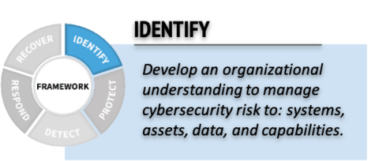
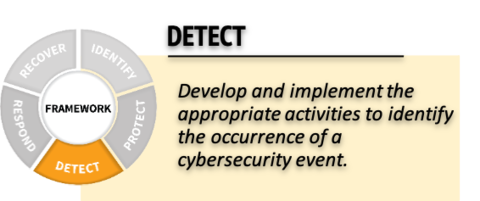
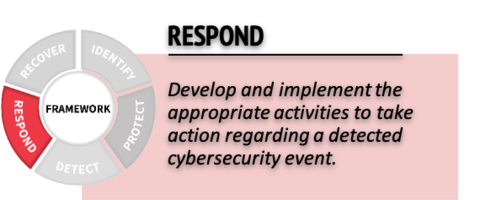

# Baseline for Security Operations

This document and associated checklist is intended to be used as a high-level self assessment to determine the capability and maturity of a security operations function for various organisations. Note this excludes the Governance, Risk and Compliance (GRC) roles and is focused primarily on how many Security Analysts are required to undertake operational **Identify**, **Detect** and **Respond** capabilities under the [WA Cyber Security Policy](https://www.wa.gov.au/government/publications/wa-government-cyber-security-policy) (and takes into consideration the oversight capabilities available entities in scope of the WA SOC). The WA SOC and this document both are aligned with [MITRE 11 Strategies of a World-Class Cybersecurity Operations Center](../pdfs/11-strategies-of-a-world-class-cybersecurity-operations-center.pdf) and [ACSC's Cyber Incident Response Plan Resource](https://www.cyber.gov.au/resources-business-and-government/essential-cyber-security/publications/cyber-incident-response-plan).

For a description of cyber security roles, please see the [Workforce Framework for Cybersecurity (NICE Framework)](https://niccs.cisa.gov/workforce-development/nice-framework) and [Mapping SFIA 8 skills to NICE work roles](https://sfia-online.org/en/tools-and-resources/sfia-views/sfia-view-information-cyber-security/mapping-nice-work-roles-to-sfia-skills) which the majority of the cyber security industry in Australia is aligned to.

<iframe width="560" height="315" src="https://www.youtube-nocookie.com/embed/IKa8Wf4F6QA?si=l1CUEMNWIlZ_VnDF" title="YouTube video player" frameborder="0" allow="accelerometer; autoplay; clipboard-write; encrypted-media; gyroscope; picture-in-picture; web-share" allowfullscreen></iframe>

## Checklist

- [ ] Define security operations scope (sensor availability, common/high impact events to focus on, business continuity objectives)

    - [ ] Ensure a **Cyber Incident Response Plan** is developed and maintained with this content (refer to the [ACSC Cyber Incident Response Plan - Word Template (docx)](../pdfs/ACSC-Cyber-Incident-Response-Plan-Template.docx) as a starting point)

- [ ] Ensure SIEM visibility across all endpoints used, applications / services delivered, and network traffic flows

    - [ ] Deploy SIEM tools to ingest endpoint, network and application telemetry. Ensure tools can be targeted with open, interoperable query formats such as [STIX](https://github.com/opencybersecurityalliance/stix-shifter) indicators and [Sigma](https://github.com/SigmaHQ/sigma) detection rules. Refer to [stix-shifter connectors](https://github.com/opencybersecurityalliance/stix-shifter/blob/develop/docs/CONNECTORS.md) and [pySigma backends](https://github.com/SigmaHQ/pySigma#backends-comparison-between-pysigma-and-sigmac) for a comprehensive list of tools with good interoperability.
    - [ ] Make available relevant [MITRE Data Sources](https://attack.mitre.org/datasources/) to the security operations team
    - [ ] Ensure the platform can be configured with automated detection capabilities for [MITRE Tactics](https://attack.mitre.org/tactics/enterprise/)

- [ ] Review and update the below security artefacts quarterly

    - [ ] **IDENTIFY** Perceived risk from common and high impact events (this can also feed into **PROTECT** control implementation)

    

    - [ ] **DETECT** Configure automated detection logic in SIEM platform for [MITRE Techniques](https://attack.mitre.org) likely to be used by threat actors based on perceived risk.

    

- [ ] **RESPOND** Ensure Operational risks have [cyber security response playbooks](../guidelines/playbooks.md) defined and exercised for common and high impact events at least annually. 
    

    - [ ] Document how to protect, respond and recover from cyber security events (see [ACSC's Cyber Incident Response Plan Resource](https://www.cyber.gov.au/resources-business-and-government/essential-cyber-security/publications/cyber-incident-response-plan)) and review [ACSC's Cyber Incident Response Readiness Checklist](https://www.cyber.gov.au/sites/default/files/2023-03/ACSC%20Cyber%20Incident%20Readiness%20Checklist_A4.pdf)
    - [ ] Document all shared responsibilities for critical business systems
    - [ ] Exercise real-world detection and response with high coverage, low risk assumed breach offensive testing (typically [Persistence](https://attack.mitre.org/tactics/TA0003), [Collection](https://attack.mitre.org/tactics/TA0009) and [Exfiltration](https://attack.mitre.org/tactics/TA0010))

## Sizing

Regarding sizing, dedicated operational security analyst roles should start at 2 FTE equivalents (scaling an additional 1 FTE for every 1-2k staff) of dedicated security roles managing:

- Endpoint Devices (EDR - e.g Microsoft Defender)
- Servers & Applications (WAF, EASM, Platforms & Infrastructure)
- Network Traffic Analytics (Flow baselining and alerting on deviations)
- Operations, Training & Awareness (understanding of how technology is used and increasing security awareness of staff in context of its use)

If the above resourcing is difficult to retain due to a small organisational size, engaging an external Managed Service Provider (MSP) to incorporate operational security typically starts at $40k AUD annual to cover 200hrs/year of effort (approx $200/hr for basic analysts):

- 50-200 staff with 2-3 incidents needing investigation each day
- 10hrs / month triaging incidents (40-60 incidents at approx 15 mins an incident) = 120hrs per year
- 20hrs / quarter detection engineering = 80hrs per year

## Vendor Management

If an external Managed Security Service Provider (MSSP) is used the contract manager should review below as part of standard vendor management activities:

- [ ] Monthly reports of incidents triaged and threat landscape
- [ ] Quarterly reporting on MITRE Data Source (events) and MITRE Tactic (detection logic) coverage
- [ ] Quarterly reporting on detection improvements and incident data quality (classification and severity)

!!! note "Complexity management"

    Consolidating MSP and MSSP services to deliver both IT management (endpoints, identities, infrastructure and platforms) and security operations functions from a single provider greatly reduces the complexity of vendor management. For business applications that aren't aligned with an organisations core enterprise architecture, they should be procured as fully managed services (i.e. SaaS) to minimise the complexity of shared responsibilities and associated risk which that incurs.
