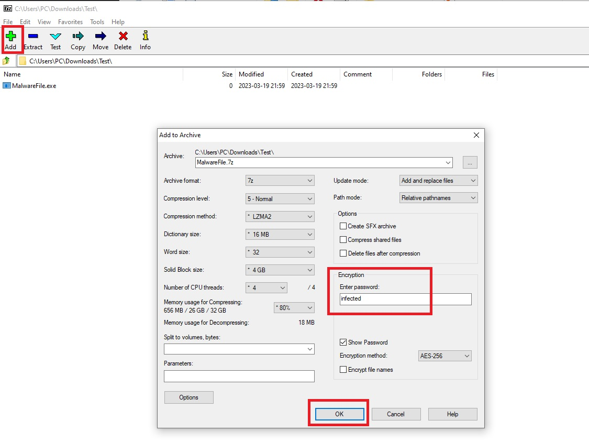
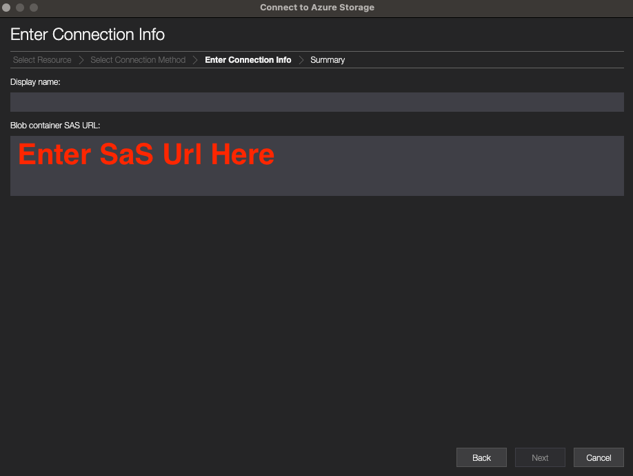

# Collecting Evidence  

In some cases, files will need to be collected and shared with the WAGov SOC for further analysis. The following provides the steps to do so.

**1. Host-Based collection** involves collecting of all windows logs (usually found under c:\Windows\System32\winevt\Logs\). Other artefacts can also be handy and we often bundle up collection into tools that perform collection of these extra artefacts automatically. 
The tools can be provided by the WAGov SOC team. 

- Housekeeper.ps1 – A PowerShell script that collects logs / process listing, service and scheduled tasks etc and stores them in a zip. For use on Windows OS’s.
- Housekeeper.sh – A bash script that collects logs / process listings, cron jobs etc. and stores them in a zip. For use on Linux OS’s.
- Velociraptor-v2.exe – Similar to housekeeper, but collects certain directories (e.g. Webroot) of interest.

It is recommended these tools to be renamed before use to hide investigative activity from the actor. All the tools require admin rights for best effect. 

**2. Malware Scan Reports** involves collecting an AV scan report on a malware infected endpoint. We recommend [Microsoft Defender Offline](https://learn.microsoft.com/en-us/microsoft-365/security/defender-endpoint/microsoft-defender-offline?view=o365-worldwide). It runs from outside the normal Windows kernel so it can target malware that attempts to bypass the Windows shell, such as viruses and rootkits that infect or overwrite the master boot record (MBR).

**3. External Facing Service** files generally involves collecting **_wwwroot_** and **_weblogs_** (for IIS this is often the same thing). 

**4. Full Disc Image** or **Memory dumps** collection can be done by using some Open Source Tools. The [Creating a VHD snapshot](https://learn.microsoft.com/en-us/azure/virtual-machines/snapshot-copy-managed-disk?tabs=portal) and [Open Source Tools for IR collection](https://aditya-pratap9557.medium.com/windows-memory-forensics-using-open-source-tools-3ec09930732e) provide the guidelines.  

# Sharing Evidence  

## Sharing small files 

e.g. Phishing Email, Malware, or small directories

Best practice is to encrypt the files to avoid detection and block by the WAGov's Defender. Use [7-Zip](https://7-zip.org/download.html) to encrypt and compress the file with **_'infected'_** as password.

If small in size, the encrypted file can be easily shared over email, Teams or directly uploaded to the case. 

## Sharing large files

**Large files** can be shared using a blob container where the files can be uploaded. WAGov SOC will provide a link to the blob container. 
Below is a process using [Azure Storage Explorer](https://docs.microsoft.com/en-us/azure/vs-azure-tools-storage-manage-with-storage-explorer) to do this securely.

### Creating a blob container to receive evidence

1. Review the following documentation in the creation of a [blob container](https://docs.microsoft.com/en-us/azure/storage/blobs/storage-quickstart-blobs-portal#create-a-container) using [Azure Storage Explorer](https://docs.microsoft.com/en-us/azure/storage/blobs/quickstart-storage-explorer).
1. Create a [shared access signature (SAS) token](https://docs.microsoft.com/en-us/azure/storage/blobs/quickstart-storage-explorer#generate-a-shared-access-signature) ready to share with relevant external organisations.

### Uploading evidence to a blob container securely using a SAS URL

1. Connect to the provided [blob container securely using a SAS url](https://docs.microsoft.com/en-us/azure/vs-azure-tools-storage-manage-with-storage-explorer?toc=%2Fazure%2Fstorage%2Fblobs%2Ftoc.json&tabs=windows#attach-to-an-individual-resource)
1. In the Select **Resource panel** of the Connect to **Azure Storage dialog**, select the **Blob Container** resource.

1. Select **Shared access signature url (SAS)** and select **Next**.

1. Enter a display name for your connection and the SAS URI for the resource. Select Next.

1. Review your connection information in the Summary panel. If the connection information is correct, select **Connect**.
1. Once connected, select **Upload** to upload the evidence to the container, and let the container owner know.

