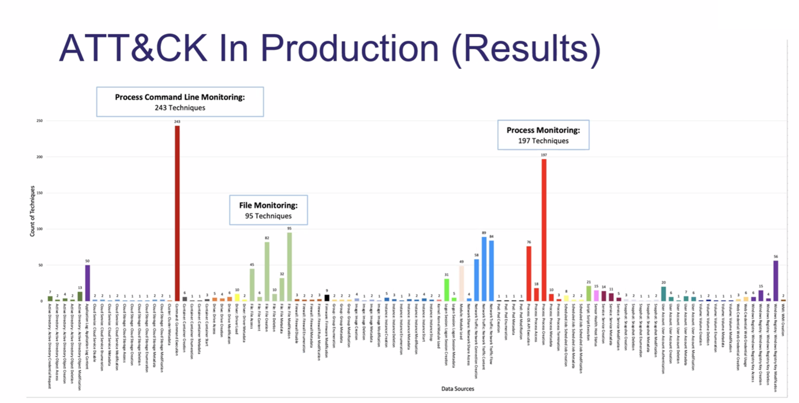

# **Observables Gap Analysis**
The following listed queries would help identify observables per endpoints 

The chart below depicts most seen observables per [MITRE ATT&CK®](https://attack.mitre.org/) tactic source: ([OSSEM project](https://github.com/OTRF/OSSEM))

## 1. Process Creation  
The following are common log sources for Process Creation events and relating kql queries to identify number of endpoints providing these observables.

| Log source  |    KQL    | 
|-------------|-----------|
| Audit Policy (SecurityEvent) | SecurityEvent \| where TimeGenerated > ago(7d) \| where EventID == 4688 \| summarize count_distinct(Computer) | 
| Sysmon (Event) | Event \| where TimeGenerated > ago(7d) \| where Source == "Microsoft-Windows-Sysmon" \| where EventID == 1 \| summarize count_distinct(Computer) |
| Defender (DeviceProcessEvents) | DeviceProcessEvents \| where TimeGenerated > ago(7d) \| summarize count_distinct(DeviceName) |
| AzureAD (VMProcess) | VMProcess \| where TimeGenerated > ago(7d) \| where isnotempty(ExecutableName) \| summarize count_distinct(Computer) |

## 2. Process Command Line   
The following kql queries will provide number of endpoints with [Command Line logging enabled](https://learn.microsoft.com/en-us/windows-server/identity/ad-ds/manage/component-updates/command-line-process-auditing). 

| Log type   |   KQL    |
|---------|-----------|
| Audit Policy (SecurityEvent) | SecurityEvent \| where TimeGenerated > ago(7d) \| where EventID == 4688 \| where isnotempty(CommandLine) \| summarize count_distinct(Computer) |
| AzureAD: VMProcess | VMProcess \| where TimeGenerated > ago(7d) \| where isnotempty(CommandLine) \|summarize count_distinct(Computer) |  
| DeviceProcessEvents | DeviceProcessEvents \| where TimeGenerated > ago(7d) \| where isnotempty(InitiatingProcessCommandLine) or isnotempty(ProcessCommandLine) \| summarize count_distinct(DeviceName) |   

## 3. Parent Process  

| Log type   |   KQL    |
|------------|----------|
| Audit Policy (SecurityEvent) | SecurityEvent \| where TimeGenerated > ago(7d) \| where EventID == 4688 \| where isnotempty(ParentProcessName) \| summarize count_distinct(Computer) |  

## 4. Microsoft Defender Device Logs 
[Connect Microsoft 365 Defender to Micrososft Sentinel](https://learn.microsoft.com/en-us/azure/sentinel/connect-microsoft-365-defender?tabs=MDE)

#### Techniques: [Microsoft Defender for Endpoint | Microsoft Security](https://www.microsoft.com/en-au/security/business/endpoint-security/microsoft-defender-endpoint?rtc=1)

| Log type        | KQL         |
|-----------------------|-------------|
|Process creation and related events  | DeviceProcessEvents   \| where TimeGenerated > ago(7d) \| summarize count_distinct(DeviceName)|  
|Network connection and related events | DeviceNetworkEvents \| where TimeGenerated > ago(7d) \| summarize count_distinct(DeviceName)|  
|Parent Process  | DeviceProcessEvents   \| where TimeGenerated > ago(7d) \| where isnotempty(InitiatingProcessParentFileName)   \| summarize count_distinct(DeviceName)|  
|Named Pipes | DeviceEvents \|   where ActionType == "NamedPipeEvent" \| where TimeGenerated >  ago(7d) \| summarize count_distinct(DeviceName)|  
|File creation, modification, and other file system events| DeviceFileEvents \| where TimeGenerated > ago(7d) \| summarize count_distinct(DeviceName)|  
|Creation and modification of registry entries |  DeviceRegistryEvents \| where TimeGenerated > ago(7d) \| summarize count_distinct(DeviceName)|  
|DLL loading events |  DeviceImageLoadEvents \| where TimeGenerated > ago(7d) \| summarize count_distinct(DeviceName)|  

## 5. Microsoft Defender Office 365 Logs Monitoring 
[Connect Microsoft 365 Defender to Micrososft Sentinel](https://learn.microsoft.com/en-us/azure/sentinel/connect-microsoft-365-defender?tabs=MDO)

| Log type                   | KQL                                                                                             |
|----------------------------|-------------------------------------------------------------------------------------------------|
| Email Events               | EmailEvents \| where TimeGenerated > ago(7d) \| summarize Time = max(TimeGenerated)             |
| Email Attachment Info      | EmailAttachmentInfo \| where TimeGenerated > ago(7d) \| summarize Time = max(TimeGenerated)     |
| Email Url Info             | EmailUrlInfo \| where TimeGenerated > ago(7d) \| summarize  Time = max(TimeGenerated)           |
| Email Post Delivery Events | EmailPostDeliveryEvents \| where TimeGenerated > ago(7d) \| summarize  Time = max(TimeGenerated)|

## 6. Important activities 

The table presented below provides a comprehensive list of significant Event IDs that can potentially signify noteworthy activities associated with malicious actions.

| Type                  | KQL                              |
|-----------------------|----------------------------------|
| Local Authentication           | SecurityEvent \| where TimeGenerated > ago(7d) \| where EventID == 4624 \| summarize count_distinct(Computer)|   
| DC Authentication              | SecurityEvent \| where TimeGenerated > ago(7d) \| where EventID == 4776 \| summarize count_distinct(Computer)|   
| Group Enumeration              | SecurityEvent \| where TimeGenerated > ago(7d) \| where EventID == 4799 \| summarize count_distinct(Computer)|   
| Kerberos                       | SecurityEvent \| where TimeGenerated > ago(7d) \| where EventID == 4769 \| summarize count_distinct(Computer)|   
| Certificate Usage (Kerb)       | SecurityEvent \| where TimeGenerated > ago(7d) \| where EventID == 4768 \| summarize count_distinct(Computer)|   
| Replication                    | SecurityEvent \| where TimeGenerated > ago(7d) \| where EventID == 4662 \| summarize count_distinct(Computer)| 
| New Scheduled Task             | SecurityEvent \| where TimeGenerated > ago(7d) \| where EventID == 4698 \| summarize count_distinct(Computer)| 
| Powershell Execution           | SecurityEvent \| where TimeGenerated > ago(7d) \| where EventID == 4104 \| summarize count_distinct(Computer)| 
| Registry Value Modification    | SecurityEvent \| where TimeGenerated > ago(7d) \| where EventID == 4657 \| summarize count_distinct(Computer)| 
| RunAs                          | SecurityEvent \| where TimeGenerated > ago(7d) \| where EventID == 4648 \| summarize count_distinct(Computer)| 
| Windows Firewall Rule Deletion | SecurityEvent \| where TimeGenerated > ago(7d) \| where EventID == 4948 \| summarize count_distinct(Computer)| 

