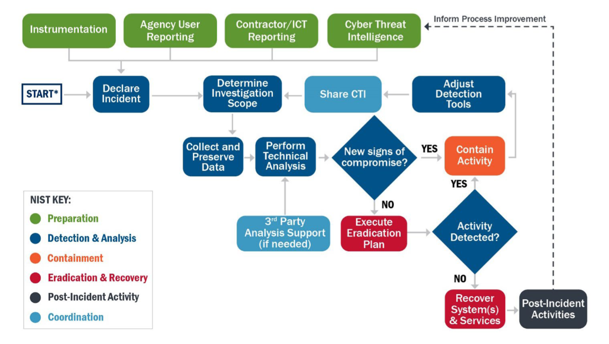

# Cyber Security Playbooks

Over time the WA SOC is establishing a set of playbooks, primarily focused on incident response that are suitable for cyber security teams with operational processes aligned to the [CISA Cybersecurity Incident and Vulnerability Response Playbooks (508C)](../pdfs/Federal_Government_Cybersecurity_Incident_and_Vulnerability_Response_Playbooks_508C.pdf) and the [MITRE 11 Strategies of a World-Class Cybersecurity Operations Center](../pdfs/11-strategies-of-a-world-class-cybersecurity-operations-center.pdf).

## 1. Triage & Investigation

Under Review, see [Sentinel Triage AssistanT (STAT)](https://github.com/briandelmsft/SentinelAutomationModules/blob/main/Docs/readme.md) as an approach to standardise and automate common triage actions.

## 2. Incident Response

In the absence of an internal procedure the CERT Societe Generale [IRM-2022 (Incident Response Methodologies 2022)
](https://github.com/wagov/IRM/tree/main/EN) are a good starting point covering the below common scenarios:

1. [Worm Infection (pdf)](https://github.com/wagov/IRM/raw/main/EN/IRM-1-WormInfection.pdf)
2. [Windows Intrusion (pdf)](https://github.com/wagov/IRM/raw/main/EN/IRM-2-WindowsIntrusion.pdf)
3. [Unix, Linux Intrusion Detection (pdf)](https://github.com/wagov/IRM/raw/main/EN/IRM-3-UnixLinuxIntrusionDetection.pdf)
4. [Distributed Denial Of Service - DDOS (pdf)](https://github.com/wagov/IRM/raw/main/EN/IRM-4-DDOS.pdf)
5. [Malicious Network Behaviour (pdf)](https://github.com/wagov/IRM/raw/main/EN/IRM-5-MaliciousNetworkBehaviour.pdf)
6. [Website Defacement (pdf)](https://github.com/wagov/IRM/raw/main/EN/IRM-6-Website-Defacement.pdf)
7. [Windows Malware Detection (pdf)](https://github.com/wagov/IRM/raw/main/EN/IRM-7-WindowsMalwareDetection.pdf)
8. [Blackmail (pdf)](https://github.com/wagov/IRM/raw/main/EN/IRM-8-Blackmail.pdf)
9. [Smartphone Malware (pdf)](https://github.com/wagov/IRM/raw/main/EN/IRM-9-SmartphoneMalware.pdf)
10. [Social Engineering (pdf)](https://github.com/wagov/IRM/raw/main/EN/IRM-10-SocialEngineering.pdf)
11. [Information Leakage (pdf)](https://github.com/wagov/IRM/raw/main/EN/IRM-11-InformationLeakage.pdf)
12. [Insider Abuse (pdf)](https://github.com/wagov/IRM/raw/main/EN/IRM-12-InsiderAbuse.pdf)
13. [Customer Phishing (pdf)](https://github.com/wagov/IRM/raw/main/EN/IRM-13-Customer_Phishing.pdf)
14. [Scam (pdf)](https://github.com/wagov/IRM/raw/main/EN/IRM-14-Scam.pdf)
15. [Trademark infringement (pdf)](https://github.com/wagov/IRM/raw/main/EN/IRM-15-Trademark%20infringement.pdf)
16. [Phishing (pdf)](https://github.com/wagov/IRM/raw/main/EN/IRM-16-Phishing.pdf)
17. [Ransomware (pdf)](https://github.com/wagov/IRM/raw/main/EN/IRM-17-Ransomware.pdf)
18. [Large scale compromise (pdf)](https://github.com/wagov/IRM/raw/main/EN/IRM-18-Large_scale_compromise.pdf)

## 3. Vulnerability Response

Under Review, refer to [Technical Example: Patch Operating Systems](https://www.cyber.gov.au/resources-business-and-government/essential-cyber-security/small-business-cyber-security/small-business-cloud-security-guide/technical-example-patch-operating-system) and [Technical Example: Patch Applications](https://www.cyber.gov.au/resources-business-and-government/essential-cyber-security/small-business-cyber-security/small-business-cloud-security-guide/technical-example-patch-applications) for good approaches to automating baseline vulnerability management.

## 4. Threat Hunting

Under Review, [Jupyter Notebooks](https://github.com/github/codespaces-jupyter) are effective, and easily query datalake type repositories, see [Use a Jupyter Notebook and kqlmagic extension to analyze data in Azure Data Explorer](https://learn.microsoft.com/en-us/azure/data-explorer/kqlmagic).

## 5. Digital Forensics

Under Review, see [Collecting Evidence](collecting-evidence.md) and [Dissect (modern forensics tooling)](https://docs.dissect.tools/en/latest/index.html) to augment SIEM activities with in depth captures as needed.
