# WASOC Onboarding Procedure

## 1. Overview

!!! note

    This procedure is focused on establishing connectivity with the WASOC, please refer to [our guidance on configuring sentinel and defender](onboarding/sentinel-guidance.md) for how to implement the associated tooling rapidly.

There are 2 delegations of access an operational security team would need to assist a customer with managing their security events and detection rules. Our customer offerings below have been constructed around the type of ongoing access and assistance required:

**Tier 0 - Advisory:** Ability for automation accounts to read security incidents, alerts, identity and device information, event data, and azure subscription resources.

- Microsoft XDR Tenant (Microsoft Entra ID) Role: [Reader](https://learn.microsoft.com/en-us/defender-xdr/create-custom-rbac-roles)
- Azure Subscription Role: [Reader](https://learn.microsoft.com/en-us/azure/role-based-access-control/built-in-roles/general#reader)

??? note "Enhanced support tiers (optional)"

    **Tier 1 - Monitor:** Increased access for analysts to work on security incidents and detection rules ontop of **Tier 0**.

    - Microsoft XDR Tenant (Microsoft Entra ID) Roles: [Global Reader](https://docs.microsoft.com/en-au/azure/active-directory/roles/permissions-reference#global-reader), [Security Operator](https://docs.microsoft.com/en-us/azure/active-directory/roles/permissions-reference#security-operator)
    - Azure Subscription Roles: [Reader](https://docs.microsoft.com/en-us/azure/role-based-access-control/built-in-roles#reader), [Microsoft Sentinel Contributor](https://docs.microsoft.com/en-us/azure/role-based-access-control/built-in-roles#microsoft-sentinel-contributor)
    - Optional configuration of [Azure AD Privileged Identity Management](https://docs.microsoft.com/en-us/azure/active-directory/privileged-identity-management/pim-configure) (PIM) for elevated access to resources during critical incident response or service configuration activities (required under **Tier 2**).

### 1.1. Azure Subscription Access

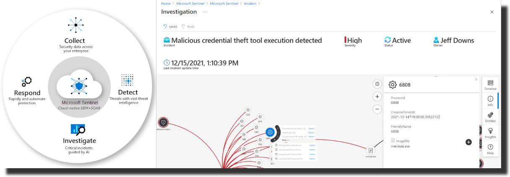

As part of onboarding, the WASOC will send the customer a prefilled [Azure Lighthouse ARM Deployment](https://docs.microsoft.com/en-us/azure/lighthouse/how-to/onboard-customer#create-your-template-manually) that can be installed as an **Service provider offer** to initiate an [Azure Lighthouse](https://docs.microsoft.com/en-us/azure/lighthouse/overview) connection between the customer Azure Subscription and the WASOC Tenant. Once completed the WASOC can delegate relevant permissions to analysts and automation processes via privileged groups in the WASOC tenant, allowing it to service the customers Azure subscription. This process needs to be undertaken for each subscription the customer would like to delegate access to.

### 1.2. Microsoft XDR tenant access

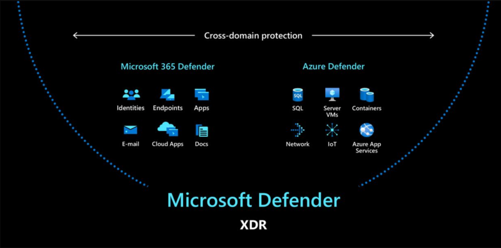

As part of onboarding, the WASOC will send the customer a [Microsoft Entra ID Security group Object ID](https://learn.microsoft.com/en-us/entra/fundamentals/how-to-manage-groups#edit-group-settings) to allow delegated access to a specific group of users within the tenancy. This Security Group ID is applicable for step (TBD).

## 2. Onboarding Process

### 2.1. Prerequisites

- [Global Admin](https://docs.microsoft.com/en-us/azure/active-directory/roles/permissions-reference#global-administrator) permission required for the Azure AD Tenant and [Owner](https://learn.microsoft.com/en-us/azure/role-based-access-control/built-in-roles#owner) permission required for the Azure Subscription(s).
    - [Access to Service provider offers](https://portal.azure.com/#view/Microsoft_Azure_CustomerHub/ServiceProvidersBladeV2/~/providers) in the Azure Portal
    - [Access to Azure Active Directory Groups](https://portal.azure.com/#view/Microsoft_AAD_IAM/GroupsManagementMenuBlade/~/AllGroups) in the Azure Portal
- List of agency Azure AD Identities (as emails) that will require access to the WASOC Incident Reporting Portal for collaboration on cyber security incidents.

## 3. Microsoft Sentinel Onboarding

### 3.1. Azure Subscription access delegation

The Azure subscription access can be delegated via the [Azure Portal](https://docs.microsoft.com/en-us/azure/lighthouse/overview).

Navigate to the [Azure Lighthouse - Service Providers](https://portal.azure.com/#view/Microsoft_Azure_CustomerHub/ServiceProvidersBladeV2/~/providers) page in the Azure portal, and select the arrow next to Add offer, and then select Add via template.

### 3.2. Azure Lighthouse ARM Deployment

Browse for the template provided, and click **Upload**. This can be customised to removed unused groups if desired for the customers Tier - please inform the WASOC of any changes prior to deployment to allow documentation to be updated.

Review the custom deployment details and ensure the location is Australia East, then click **Review and create** then click **Create**.

### 3.3. Dedicated Cluster

The WASOC Dedicated Cluster program is an initiative to assist with reducing the total cost of ownership (TCO) of customers Sentinel Workspace. This is achieved by utilising a centralised [pricing model](https://learn.microsoft.com/en-us/azure/azure-monitor/logs/logs-dedicated-clusters?tabs=cli#cluster-pricing-model) offered by Microsoft as part of the [dedicated cluster services](https://learn.microsoft.com/en-us/azure/azure-monitor/logs/logs-dedicated-clusters?tabs=cli#advanced-capabilities).

??? note "Customer Prerequisite"

    The dedicated cluster has prerequisites that **must** be met to have the minimum technical requirements to onboard ([link](https://learn.microsoft.com/en-us/azure/azure-monitor/logs/logs-dedicated-clusters?tabs=cli#link-a-workspace-to-a-cluster)) an sentinel workspace.

    The prerequisites as follows.

    - Must be on Microsoft [Enterprise Agreement](https://www.wa.gov.au/government/cuas/supply-of-microsoft-product-licences-and-licensing-solutions-cuams2019)
        - E licensing ([Compare Microsoft 365 Enterprise Plans](https://www.microsoft.com/en-au/microsoft-365/enterprise/microsoft365-plans-and-pricing))
    - Must have signed an exisiting MOU (T0,T1,T2) with the WASOC
    - Customers Workspace must be located in region **Australia EAST**
    - Must have been already onboarded to the WASOC via [Azure Lighthouse](https://soc.cyber.wa.gov.au//onboarding/#23-azure-subscription-access-delegation)
    - Must have Log Analytics workspace *Access Mode* set to **Use resource or workspace permissions**. [Log Analytics Access Mode](https://learn.microsoft.com/en-us/azure/azure-monitor/logs/manage-access?tabs=portal#access-control-mode)

The onboarding to the Dedicated Cluster is handled entirely by the WASOC Engineers and can be facilitated upon request.

## 4. Microsoft XDR Onboarding

### 4.1. Microsoft Entra ID B2B Synchornisation

The WASOC leverages the [Microsoft Entra ID cross-tenant synchronisation services](https://learn.microsoft.com/en-us/entra/identity/multi-tenant-organizations/cross-tenant-synchronization-configure) to replicates WASOC analysts indentities from the source tenancy to the entities tenancy. This allows WASOC analysts to authenticate to entities XDR environment seamlessly.

### 4.1.1 Enable User Synchronisation with the WASOC

1. Sign in to the [Microsoft Entra admin center](https://entra.microsoft.com/).

1. Navigate to **Identity > External Identities > Cross-tenant access settings**.

1. On the **Organization settings** tab, select **Add organization**.

1. Add the **External Microsoft Entra Tenant ID** provived by the WASOC

1. Select **Add**

    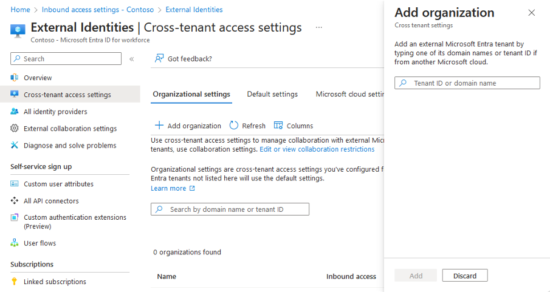

1. In the newly created Organisation, select **Inbound access** of the newly added organization, and configure the **B2B collaboration** as follows.

    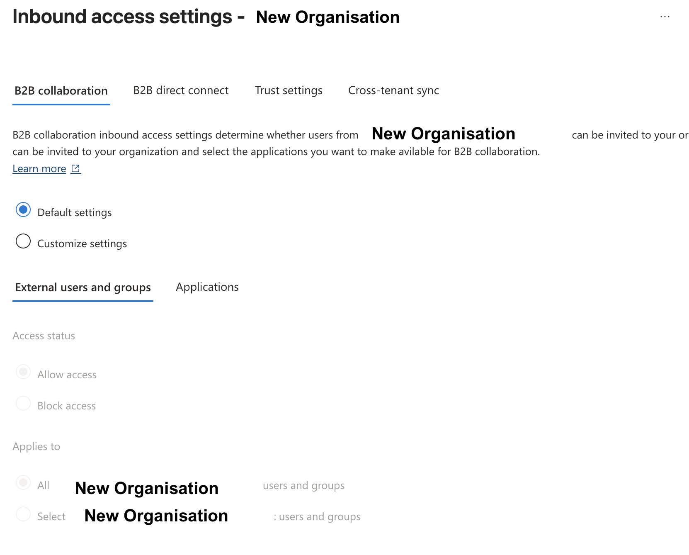

1. Confirm the **External user and groups > Access Status** set *Allow access* > **Applies to** *All*

1. Click **Save**

1. Select the **Cross-tenant sync** tab.

1. Select the **Allow users sync into this tenant** checkbox.

    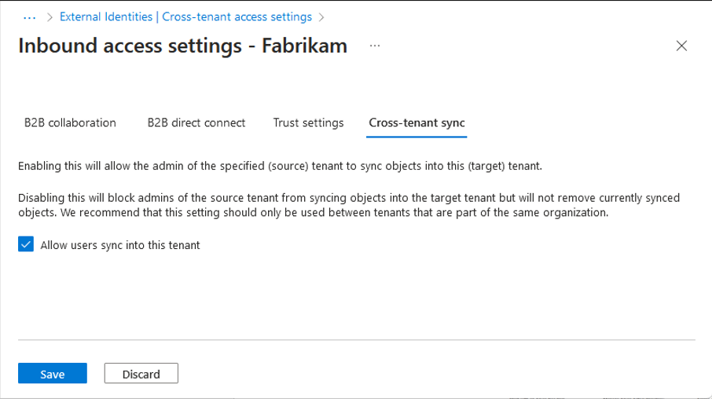

1. Select **Save**.

1. If the **Enable cross-tenant sync and auto-redemption dialog box** is prompted, asking if you want to enable auto-redemption, select **Yes**.

    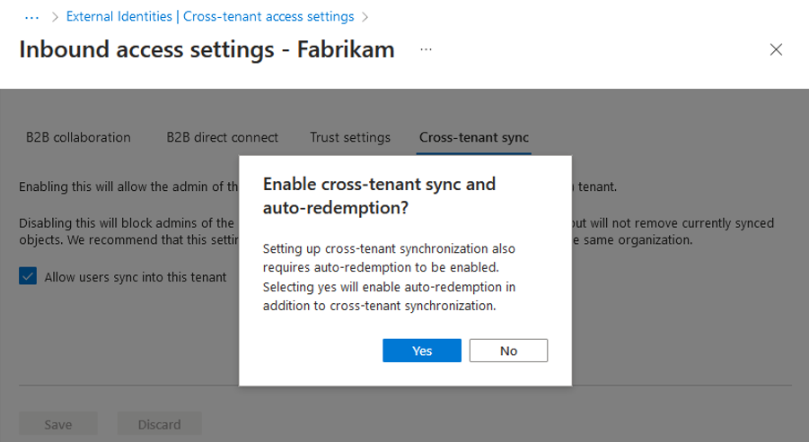

1. Select the *Trust settings*\* tab.

1. Select **Customize Settings** and then select **Trust multifactor authentication from Microsoft Entra tenant**.

    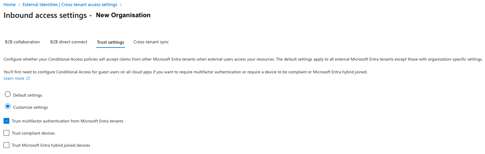

1. Check the automatically redeem invitations with the newly added organization checkbox.

    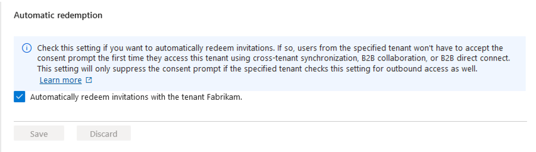

1. Select **Save**

### 4.1.2 Configuration of Security Groups in Microsoft Entra ID

1. In the Azure Portal, navigate to Microsoft Entra ID (AAD) service.

1. In **Manage > Groups** > create *New Group*.

1. Configure the **New Group** fields as follows.

    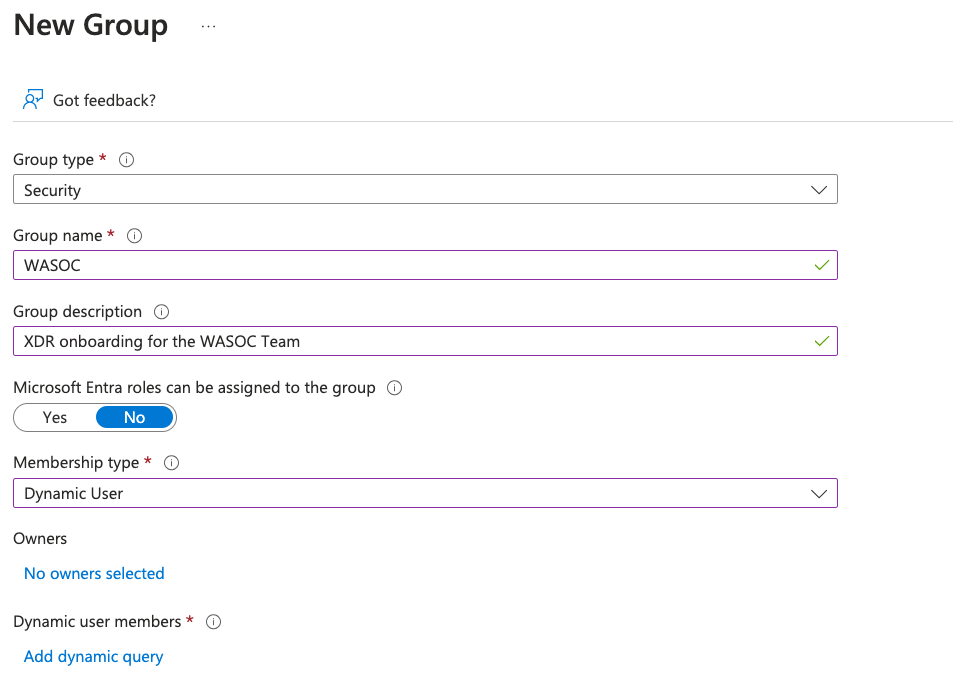

1. Underneath **Dynamic User Members**, click **Add Dynamic Query**

1. In **Configure Rules**, amend a rule where user field Property **companyName** > Operator **Equals** > Value **WASOC**

    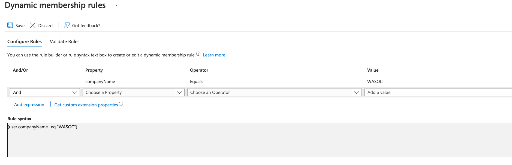

1. Click **Add Expression**.

1. Click **Save**.

1. Click **Create**.

### 4.2 XDR Unified RBAC Method

The new [XDR Unifed Role Based Access Control (RBAC)](https://learn.microsoft.com/en-us/defender-xdr/manage-rbac) provides a single permissions management experience that provides one central location for administrators to control user permissions across different security solutions.

!!! note

    This solution is a recent addition to the Microsoft XDR and will require some administrative work by the entities to activate the [XDR RBAC experience](https://learn.microsoft.com/en-us/defender-xdr/activate-defender-rbac#activate-in-microsoft-defender-xdr-settings). This work will require some pre-work with entities IT teams as exisiting permission to users and account may cause service interruption. [A mapping exercise will be required.](https://learn.microsoft.com/en-us/defender-xdr/compare-rbac-roles)

### 4.2.1 Activate Unifed Role Based Access Controls

1. Navigate to the [Microsoft Security Portal](https://security.microsoft.com/)

1. In **Systems > Settings > Microsoft Defender XDR > Permissions and roles**

1. Toggle all avaiable **WorkLoads** as **Active**.

    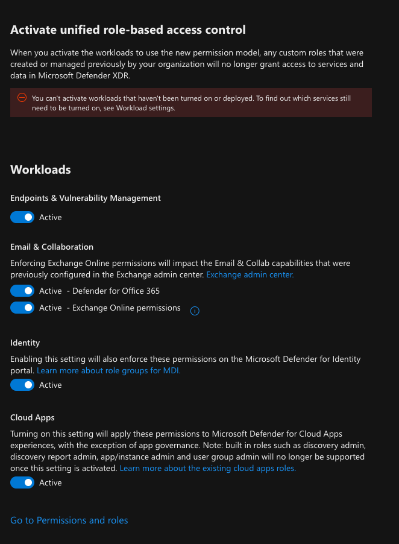

### 4.2.2 Configuration of Security Groups permission in Microsoft Security Portal (XDR)

1. Navigate to the [Microsoft Security Portal](https://security.microsoft.com/)
1. In **Systems > Permissions > Microsoft Defender XDR (Roles)**
1. Click Create custom role
1. In Set up the basics fill the following fields
    - Role Name: WASOC Team
    - Description: WASOC Team access to XDR and Microsoft Security Stack
1. In Choose Permission, configure the following for all Permission Groups

#### Security Operations

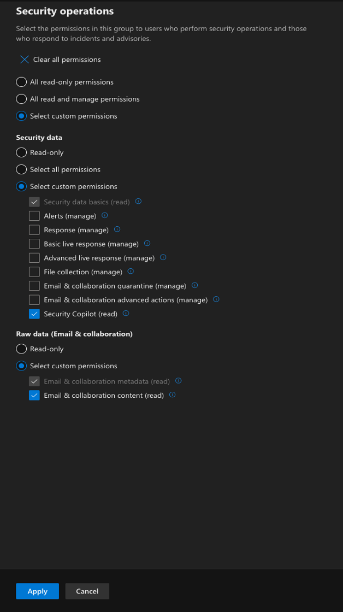

#### Security Posture

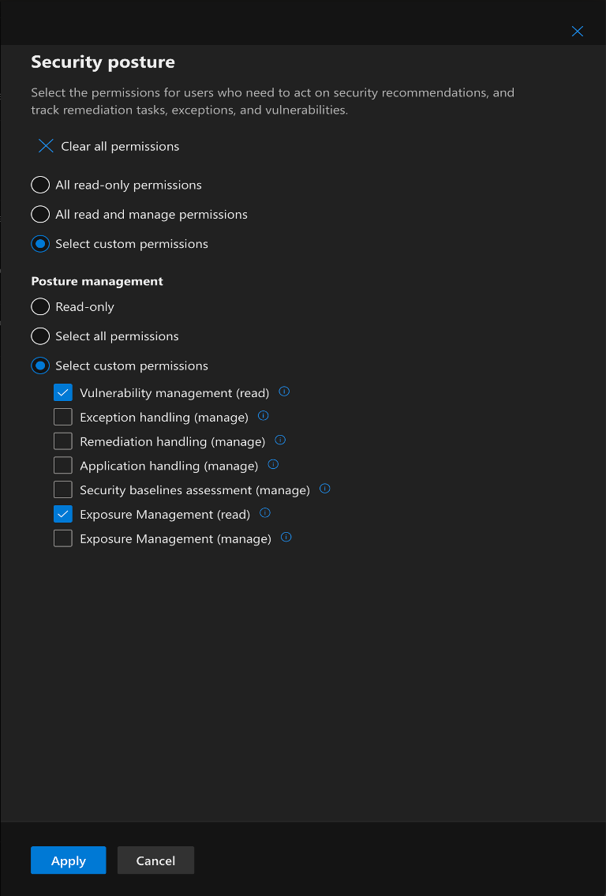

#### Authorisation and Settings

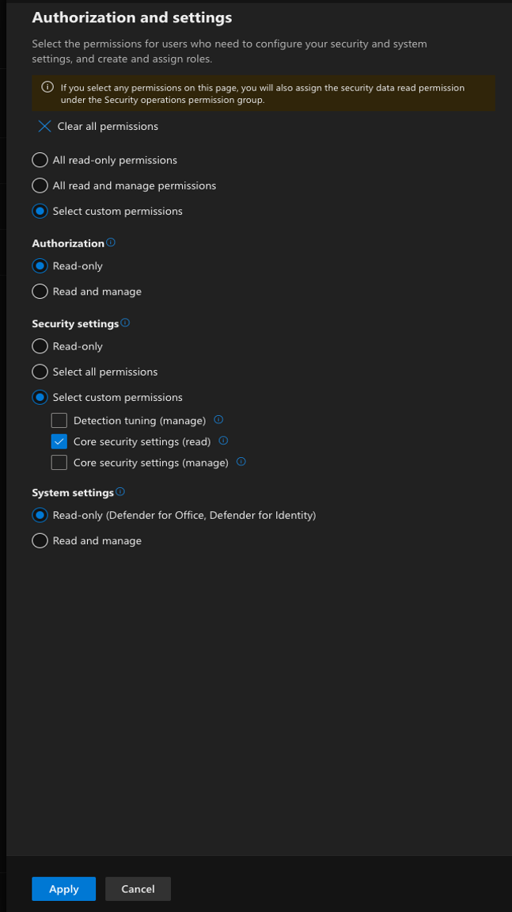

1. In **Assign user and data sources**, click **Add assignment**.

1. In **Add assignment**, fill and tick fields as shown:

    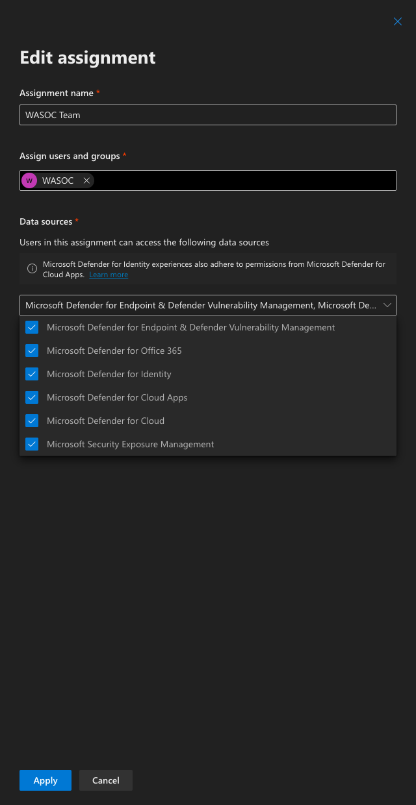

1. Check the **Include future data sources automatically** checkbox

    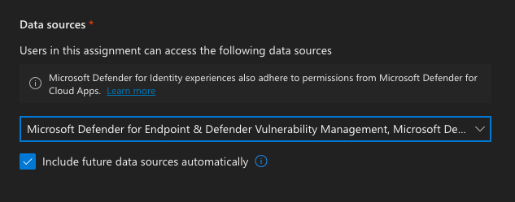

1. Click **Add**

1. In **Review and finish**, click **Submit**

## 5. Confirmation of Onboarding

### 5.1 Sentinel Onboarding

Once the template phase has completed, customers can confirm the onboarding process has finalised by navigating to the [Azure Lighthouse - Service Providers](https://portal.azure.com/#view/Microsoft_Azure_CustomerHub/ServiceProvidersBladeV2/~/providers) page and confirming you can see the **WASOC - Security Insights** service offer.

### 5.2 XDR Onboarding

Once XDR onboarding procedure has been completed by the entity, the WASOC will commence some addtional proceesses to finalise the onboarding process.
The WASOC will inform the entity once the onboarding has been completed.

## 6. Migrate to Microsoft Sentinel Data Lake for Cost Optimization

The Data Lake storage tier provides cost-effective, long-term storage for logs, especially for third-party logs and Sentinel tables beyond the 90-day free retention period.
Data retatined in Data Lake is available to Securtiy Operations Team for long-term analysis and threat hunting capabilities.

### 6.1 Cost-Saving Strategies

- Configure Sentinel Tables on Analytic Tier storage to migrate after 90-days (free retention period) to the Data Lake tier for lower-cost retention. Use the [Data Retention settings](https://learn.microsoft.com/en-us/azure/sentinel/configure-data-retention-archive) in the Sentinel workspace to define retention periods and archiving rules.
- For third-party logs, configure data connectors to route logs directly to the Data Lake as they are more expensive to store in Sentinel’s analytics storage tier. Refer to [Configure connectors for Third-Party (non-Microsoft) Logs in Data Lake](https://learn.microsoft.com/en-us/azure/sentinel/datalake/sentinel-lake-connectors)

## 7. Migrate Sentinel to Defender XDR portal.

Microsoft is consolidating the cyber security solutions by integrating Sentinel into the Microsoft Defender portal, creating a unified SIEM and XDR experience. Refer to [Transition your Microsoft Sentinel environment to the Defender portal](https://learn.microsoft.com/en-us/azure/sentinel/move-to-defender) guide.

Key Dates:

- From 1 July 2025: All new Sentinel customers will onboard via the Defender portal.
- By 1 July 2026: The [Azure Portal experience for Sentinel](https://learn.microsoft.com/en-us/azure/sentinel/microsoft-sentinel-defender-portal) will be planned retired.

## 8. WASOC Offboarding / Re-onboarding Procedure

### 8.1. Sentinel Offboarding / Re-onboarding

If for the purpose of offboarding the WASOC or to re-onboard onto the WASOC, then the customer has the ability to self manage this process via the **Azure Portal**.

#### Azure Lighthouse Service Provider

Navigating to the [Azure Lighthouse - Service Providers](https://portal.azure.com/#view/Microsoft_Azure_CustomerHub/ServiceProvidersBladeV2/~/providers) page. Select the **WASOC - Security Insights** service offer. Click **Delete**.

### 8.2. XDR Offboarding

If for the purpose of offboarding the WASOC off the XDR platform, then the customer has the ability to self manage this process via the **Azure Portal**.

#### Microsoft Entra ID

1. Sign in to the [Microsoft Entra admin center](https://entra.microsoft.com/).

1. Navigate to **Identity > External Identities > Cross-tenant access settings**.

1. On the **Organization settings** tab, navigate to the organisation associated to the WASOC.

1. In the **remove** column, click the dustbin icon

    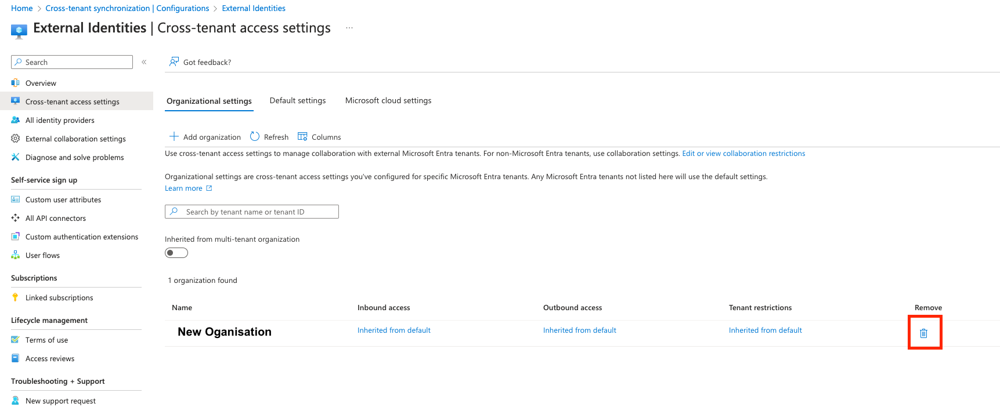
