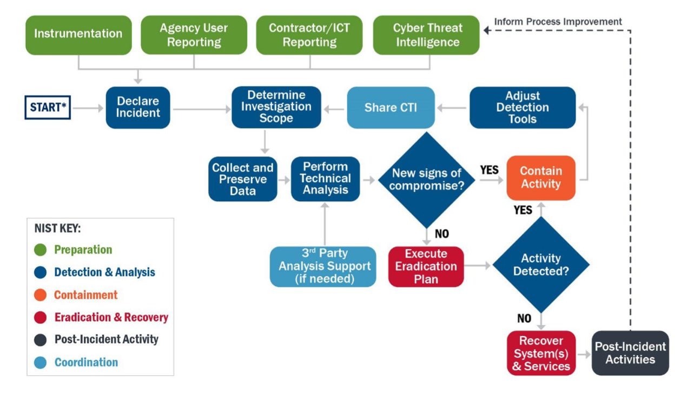

# Cyber Security Playbooks

Over time the WA SOC is establishing a set of playbooks, primarily focused on incident response that are suitable for cyber security teams with operational processes aligned to the [CISA Cybersecurity Incident and Vulnerability Response Playbooks (508C)](pdfs/Federal_Government_Cybersecurity_Incident_and_Vulnerability_Response_Playbooks_508C.pdf) and the [MITRE 11 Strategies of a World-Class Cybersecurity Operations Center](pdfs/11-strategies-of-a-world-class-cybersecurity-operations-center.pdf)

## 1. Triage & Investigation

Under Review

## 2. Incident Response

In the absence of an internal procedure the CERT Societe Generale [IRM-2022 (Incident Response Methodologies 2022)
](https://github.com/wagov/IRM/tree/main/EN) are a good starting point covering the below common scenarios:

- [IRM-1-WormInfection.pdf](https://github.com/wagov/IRM/raw/main/EN/IRM-1-WormInfection.pdf)
- [IRM-2-WindowsIntrusion.pdf](https://github.com/wagov/IRM/raw/main/EN/IRM-2-WindowsIntrusion.pdf)
- [IRM-3-UnixLinuxIntrusionDetection.pdf](https://github.com/wagov/IRM/raw/main/EN/IRM-3-UnixLinuxIntrusionDetection.pdf)
- [IRM-4-DDOS.pdf](https://github.com/wagov/IRM/raw/main/EN/IRM-4-DDOS.pdf)
- [IRM-5-MaliciousNetworkBehaviour.pdf](https://github.com/wagov/IRM/raw/main/EN/IRM-5-MaliciousNetworkBehaviour.pdf)
- [IRM-6-Website-Defacement.pdf](https://github.com/wagov/IRM/raw/main/EN/IRM-6-Website-Defacement.pdf)
- [IRM-7-WindowsMalwareDetection.pdf](https://github.com/wagov/IRM/raw/main/EN/IRM-7-WindowsMalwareDetection.pdf)
- [IRM-8-Blackmail.pdf](https://github.com/wagov/IRM/raw/main/EN/IRM-8-Blackmail.pdf)
- [IRM-9-SmartphoneMalware.pdf](https://github.com/wagov/IRM/raw/main/EN/IRM-9-SmartphoneMalware.pdf)
- [IRM-10-SocialEngineering.pdf](https://github.com/wagov/IRM/raw/main/EN/IRM-10-SocialEngineering.pdf)
- [IRM-11-InformationLeakage.pdf](https://github.com/wagov/IRM/raw/main/EN/IRM-11-InformationLeakage.pdf)
- [IRM-12-InsiderAbuse.pdf](https://github.com/wagov/IRM/raw/main/EN/IRM-12-InsiderAbuse.pdf)
- [IRM-13-Customer_Phishing.pdf](https://github.com/wagov/IRM/raw/main/EN/IRM-13-Customer_Phishing.pdf)
- [IRM-14-Scam.pdf](https://github.com/wagov/IRM/raw/main/EN/IRM-14-Scam.pdf)
- [IRM-15-Trademark infringement.pdf](https://github.com/wagov/IRM/raw/main/EN/IRM-15-Trademark%20infringement.pdf)
- [IRM-16-Phishing.pdf](https://github.com/wagov/IRM/raw/main/EN/IRM-16-Phishing.pdf)
- [IRM-17-Ransomware.pdf](https://github.com/wagov/IRM/raw/main/EN/IRM-17-Ransomware.pdf)
- [IRM-18-Large_scale_compromise.pdf](https://github.com/wagov/IRM/raw/main/EN/IRM-18-Large_scale_compromise.pdf)

## 3. Vulnerability Response

## 4. Threat Hunting

Under Review

## 5. Digital Forensics

Under Review, see [Collecting Evidence](collecting-evidence.md)
