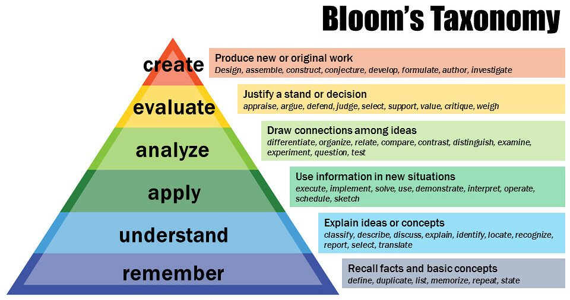

# DevSecOps Induction

## 1. Getting Started

[The Learning Journey](https://taggartinstitute.org/p/the-learning-journey) is an excellent starting point for how to self teach using resources like those below.

By the end of the learning journey course, the learner should be able to:

- Use [Obsidian](https://obsidian.md/) for note-taking and planning
- Recognize the various [levels of learning](https://en.wikipedia.org/wiki/Bloom%27s_taxonomy)
- Create a Learning Plan and Study Map to guide their journey (also see [Maker Skill Trees](https://github.com/sjpiper145/MakerSkillTree))
- Effectively evaluate learning/information resources for quality and appropriateness
- Self-assess learning via metacognition
- Create Exhibitions of Mastery to demonstrate success

Note: Timeline estimates assume 5-10 hours of study per week alongside regular work duties. Progress may vary based on prior experience and available study time.

## 2. Free Training Resources

These are our recommended resources for building core technical skillsets.

### 2.1. Cloud Native Fundamentals (4-6 weeks)

**👉 New Team Members Start Here!**

The below links will get you across the cloud native methodology to build, test and deliver infrastructure and software. These skills apply to the subsequent infrastructure operation and development guidance sections.

- [GitLab Basics: Start Using Git:](https://docs.gitlab.com/ee/gitlab-basics/start-using-git.html) Learn how to set up Git, clone repositories, and work with branches using GitLab. GitLab Basics: Start Using Git
- [GitHub Codespaces: Using Source Control](https://docs.github.com/en/codespaces/developing-in-a-codespace/using-source-control-in-your-codespace): Perform all Git actions directly within your codespace, including committing changes, creating branches, and raising pull requests.
- [GitHub Actions: Writing Workflows Quickstart](https://docs.github.com/en/actions/writing-workflows/quickstart): automate your build, test, and deployment pipeline.
    - [just](https://just.systems/man/en/) is a handy way to save and run project-specific commands. Note that its a cleaner approach to design and implement actions using a tool like `just` in your project, and then call the tool from your CI/CD tooling (like GitHub Actions) to make it straightforward to test locally and keep logic portable between CI/CD tools.
- [Ansible YAML Syntax](https://docs.ansible.com/ansible/latest/reference_appendices/YAMLSyntax.html): An overview of correct YAML syntax used in Ansible playbooks, including lists, dictionaries, and more.
- [Terraform Configuration Syntax](https://www.terraform.io/docs/configuration/syntax.html): Detailed description of the syntax used in Terraform configuration files, including arguments and blocks.
    - [Terraform AWS Provider](https://registry.terraform.io/providers/hashicorp/aws/latest/docs): Use the Amazon Web Services (AWS) provider to interact with the many resources supported by AWS.
    - [Terraform Azure Provider](https://registry.terraform.io/providers/hashicorp/azurerm/latest): The Azure Provider can be used to configure infrastructure in Microsoft Azure using the Azure Resource Manager API's.
- [Kubernetes Basics](https://kubernetes.io/docs/tutorials/kubernetes-basics/): A tutorial providing a walkthrough of the basics of Kubernetes workload orchestration.
    - [Introduction to Kubectl and Kustomize](https://kubectl.docs.kubernetes.io/guides/introduction/), also has an excellent section on configuration management covering [secrets](https://kubectl.docs.kubernetes.io/guides/config_management/secrets_configmaps/), [namespaces](https://kubectl.docs.kubernetes.io/guides/config_management/namespaces_names/), and [labels](https://kubectl.docs.kubernetes.io/guides/config_management/labels_annotations/), a video covering this content is below.

      <iframe width="560" height="315" src="https://www.youtube-nocookie.com/embed/spCdNeNCuFU?si=fRi2neSneYoqg80T" title="YouTube video player" frameborder="0" allow="accelerometer; autoplay; clipboard-write; encrypted-media; gyroscope; picture-in-picture; web-share" referrerpolicy="strict-origin-when-cross-origin" allowfullscreen></iframe>
    
    - [Skaffold](https://skaffold.dev/) handles the workflow for building, pushing and deploying your application, allowing you to focus on writing code.
- [Nine Key Cloud Security Concentrations & SWAT Checklist](https://www.sans.org/posters/nine-key-cloud-security-concentrations-swat-checklist/): A set of best practices for cloud security, broken down by AWS, Azure, and GCP, to help create more secure applications.

### 2.2. Cloud Platform Essentials (2-3 weeks)

These are intro courses and security overviews of the major AWS and Azure platforms (as they use a lot of cloud specific nomenclature it's worth getting across).

#### AWS Resources

- [Amazon EKS Quickstart: Deploy a web app and store data](https://docs.aws.amazon.com/eks/latest/userguide/quickstart.html)
- [AWS Cloud Practitioner Essentials](https://explore.skillbuilder.aws/learn/courses/134/aws-cloud-practitioner-essentials)
- [AWS Security Fundamentals Second Edition](https://explore.skillbuilder.aws/learn/courses/48/aws-security-fundamentals)

#### Azure Resources

- [Microsoft AKS Quickstart: Deploy an application from a code repository](https://learn.microsoft.com/en-us/azure/aks/automatic/quick-automatic-from-code)
- [Microsoft Azure Fundamentals](https://learn.microsoft.com/en-us/training/courses/az-900t00)
- [Microsoft Security Academy](https://microsoft.github.io/PartnerResources/skilling/microsoft-security-academy/start)

### 2.3. Development Paths

Understanding the [OWASP Projects](https://owasp.org/projects/) focused on Secure Development Life Cycle’s (SDLC) will help in getting across the common security capabilities platforms and software should generally have. The below **Data Integration** and **Frontend Frameworks** all are typically secure by default, however the way they are deployed can significantly change their risk profile. For production or high risk environments it’s always best to review the operational procedures against the 2 above standards.

#### Backend Development (4-6 weeks)

Expected outcomes: Basic programming skills, understanding of software design principles and secure development practices

For backends, using a modern API framework like [Huma](https://huma.rocks/why/) ([Your First API tutorial](https://huma.rocks/tutorial/your-first-api/)) is strongly recommended. There is a great video series on Golang as well below:

<iframe width="560" height="315" src="https://www.youtube-nocookie.com/embed/videoseries?si=fpNruzeYKKF1woJZ&amp;list=PLoILbKo9rG3skRCj37Kn5Zj803hhiuRK6" title="YouTube video player" frameborder="0" allow="accelerometer; autoplay; clipboard-write; encrypted-media; gyroscope; picture-in-picture; web-share" referrerpolicy="strict-origin-when-cross-origin" allowfullscreen></iframe>

##### Software and code security

- [Safestack intro course](https://safestack.io/free-application-security-program/)
- [OWASP Application Security Verification Standard](https://owasp.org/www-project-application-security-verification-standard/) for software executing on servers (such as Websites and API’s) - default to ASVS Level 2
- [OWASP Mobile ASVS](https://mas.owasp.org/MASVS/) for software executing on clients (such as Mobile Applications) - default to MAS-L2
- Testing & QA - Scan for vulnerabilities and configuration/secret issues with [Trivy](https://aquasecurity.github.io/trivy/), [Prowler](https://github.com/prowler-cloud/prowler) and [checkov](https://github.com/bridgecrewio/checkov). Run static analysis of codebases to find common issues with [semgrep](https://github.com/semgrep/semgrep), [CodeQL](https://docs.github.com/en/code-security/code-scanning/introduction-to-code-scanning/about-code-scanning-with-codeql) or [Snyq](https://docs.snyk.io/snyk-cli/getting-started-with-the-snyk-cli).
- Testing & QA - Test websites with [playwright](https://playwright.dev/) and APIs with [Hurl](https://github.com/Orange-OpenSource/hurl) or [Grafana K6](https://github.com/grafana/k6).

#### Data Integration (2-3 weeks each)

Expected outcomes: Understanding how to ingest/manage data with Python and SQL and generate reports with Markdown

Start with building a web app using [evidence.dev](https://docs.evidence.dev/build-your-first-app/) (that makes it easy to generate slick [Apache ECharts](https://echarts.apache.org/en/cheat-sheet.html) visuals). Once you have the basics of how to collate and view data with SQL, then dive into the [SQLMesh CLI quickstart](https://sqlmesh.readthedocs.io/en/stable/quickstart/cli/) to understand how SQL (and python) can be used to transform data at scale. The large number of [execution engines](https://sqlmesh.readthedocs.io/en/stable/integrations/overview/) SQLMesh can use in addition to the [DuckDB Friendly SQL](https://duckdb.org/docs/sql/dialect/friendly_sql.html) its in memory processing can do should make almost any data activities easy to model, test and execute.

Massive datasets should use approaches like [incremental by time range](https://sqlmesh.readthedocs.io/en/stable/guides/incremental_time/) which enable only loading relevant chunks of data as needed. Using the [Athena](https://sqlmesh.readthedocs.io/en/stable/integrations/engines/athena/) execution engine across [Amazon S3 Tables](https://docs.aws.amazon.com/AmazonS3/latest/userguide/s3-tables.html) makes it straightforward to run a managed [Apache Iceberg](https://iceberg.apache.org/) data lake that is suitable for petabyte scale datasets.

Some reporting requirements lead to static / document style reports, in which case [Quarto](https://quarto.org/docs/get-started/hello/jupyter.html) is an excellent open-source scientific and technical publishing system, that supports [Hugo markdown](https://quarto.org/docs/output-formats/hugo.html) for simple documents and [Typst](https://quarto.org/docs/output-formats/typst.html) for advanced typesetting.

For more details on the languages used by the above tools, see below:

- [DuckDB SQL Introduction](https://duckdb.org/docs/sql/introduction.html)
- [Python by example](https://third-bit.com/sdxpy/)
- [Hands-On Programming with R](https://rstudio-education.github.io/hopr/)

#### Frontend frameworks (1-2 weeks each)

- [JavaScript](https://third-bit.com/sdxjs/) (understand JS basics)

The below frameworks are all focused on having simple, minimal code easy for small teams to maintain.

- [Streamlit](https://edit.share.stlite.net) in browser python prototypes can be used for fast prototypes in python that compiles to browser.
- [Hugo](https://gohugo.io/) and [Zola](https://www.getzola.org) are fast simple static site generators.
- [Astro](https://astro.build) is extensible with Javascript/Typescript.
- [Material for MkDocs](https://squidfunk.github.io/mkdocs-material/) is extensible with Python/Jinja.

## 3. Paid Certifications (2-3 months)

The SANS courses / certifications are the hardest (at least 50-100hrs study effort per cert) but most in depth:

- [SANS SEC540: Cloud Security and DevSecOps Automation](https://www.sans.org/cyber-security-courses/cloud-security-devsecops-automation/) - Operations Focus
- [SANS SEC522: Application Security: Securing Web Applications, APIs, and Microservices](https://www.sans.org/cyber-security-courses/application-security-securing-web-apps-api-microservices/) - Development Focus

Otherwise the lower cost certs below are all a fair bit shorter while also being high quality:

- [Linux Foundation Certified Kubernetes Administrator (CKA) + Certified Kubernetes Application Developer (CKAD) + Certified Kubernetes Security Specialist (CKS) Exam Bundle](https://training.linuxfoundation.org/training/cka-ckad-cks-exam-bundle/)
- [AWS Certified Solutions Architect - Associate](https://aws.amazon.com/certification/certified-solutions-architect-associate/)
- [Microsoft Certified: Azure Developer Associate](https://learn.microsoft.com/en-us/credentials/certifications/azure-developer/?practice-assessment-type=certification)

## 4. Useful links and tools

- [Maker Skill Trees](https://github.com/sjpiper145/MakerSkillTree) are printable templates that can you can use to visualize your skill progress, identify skill gaps and get inspired to try new things.
- [excalidraw](https://excalidraw.com/): Virtual whiteboard for sketching hand-drawn like diagrams, can import/edit mermaid diagrams.
- [Talos Linux](https://www.talos.dev/) is Linux designed for Kubernetes – secure, immutable, and minimal. It only takes 3 minutes to [launch a Talos cluster](https://www.talos.dev/docs/latest/introduction/quickstart/) on your laptop inside Docker.
- [Percona Everest](https://docs.percona.com/everest/index.html): open-source platform for automated database provisioning and management. It supports multiple database technologies and can be hosted on any Kubernetes infrastructure, in the cloud or on-premises.
- [LocalStack](https://docs.localstack.cloud/getting-started/) is a cloud service emulator that runs in a single container on your laptop or in your CI environment.
- [project Bluefin](https://projectbluefin.io/): Linux workstation, designed for reliability, performance, and sustainability.
- [Homebrew](https://brew.sh/): The Missing Package Manager for macOS (or Linux)
- [just](https://just.systems/man/en/) is a handy way to save and run project-specific commands.
- [DGOV DTT Architecture Decision Records](https://github.com/wagov-dtt/architecture-decision-records) is a list of architecture decisions supporting [DTT platforms and capabilities](https://www.wa.gov.au/organisation/department-of-the-premier-and-cabinet/office-of-digital-government/digital-transformation-technology).
- [ugrep](https://github.com/Genivia/ugrep) is a more powerful, ultra fast, user-friendly, compatible grep replacement. Includes a TUI, Google-like Boolean search with AND/OR/NOT, fuzzy search, hexdumps, searches (nested) archives (zip, 7z, tar, pax, cpio), compressed files (gz, Z, bz2, lzma, xz, lz4, zstd, brotli), pdfs, docs, and more.
- [Page Assist](https://github.com/n4ze3m/page-assist) is an open-source browser extension that provides a sidebar and web UI for your local AI model.
- [ollama](https://ollama.com/) can run Llama 3.3, DeepSeek-R1, Phi-4, Mistral, Gemma 2, and other models, locally.

### 4.1 Certified Kubernetes platforms

The below hyperscaler managed [Certified Kubernetes platforms](https://www.cncf.io/training/certification/software-conformance/#logos) all automate the operations of compute nodes, block storage and network load balancers which greatly simplifies running k8s workloads.

- [Amazon EKS – EKS Auto Mode](https://docs.aws.amazon.com/eks/latest/userguide/getting-started-automode.html)
- [Azure Kubernetes Service (AKS) Automatic](https://learn.microsoft.com/en-us/azure/aks/intro-aks-automatic)
- [Google Kubernetes Engine (GKE) Autopilot mode](https://cloud.google.com/kubernetes-engine/docs/how-to/creating-an-autopilot-cluster)
