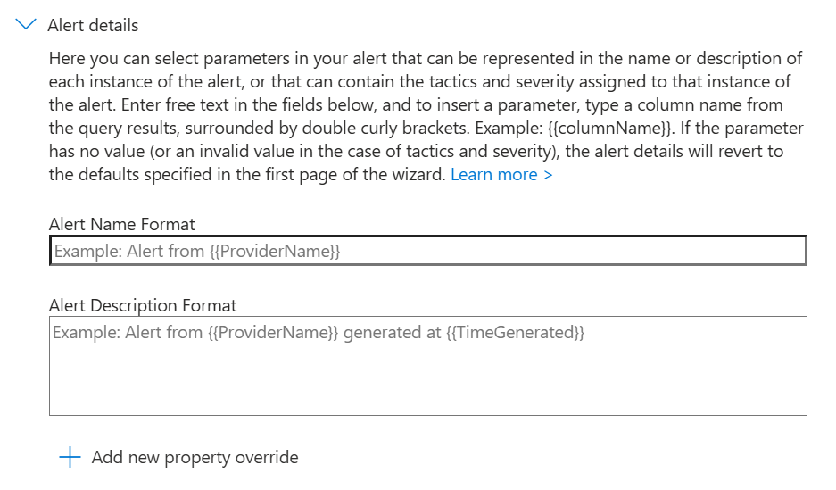
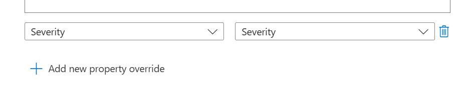

# Update an Analytic Rule Alert Overrides
This page contains information and instructions for configuring / updating an analytic rule's alert overrides.

## What are Alert Overrides
Alert overrides are a feature of Sentinel Analytic rules which allow you to dynamically configure different properties from column values in the alert's KQL query such as the `Title`, `Description`, `Severity` and more.

For example, you can configure an alert’s Severity dynamically based on an extended column. The example query snippet below demonstrates how to create an extended column that can be used for alert overrides. *In this example, if the condition in the expression evaluates to true, the Severity is set to High; otherwise, it defaults to Medium.*

```sql
| extend Severity = iff(true == true, "High", "Medium")
```

## Instructions
1. Go to the affected **Sentinel** workspace.

    If you are unsure where to find your workspaces, visit this link -> [https://portal.azure.com/sentinel](https://portal.azure.com/#browse/microsoft.securityinsightsarg%2Fsentinel).

2. Once you have selected your Sentinel workspace, on the left hand side of the screen, navigate to **Configuration** -> **Analytics**.
    
    (You may need to expand the sub-menus).

3. **Search** for and **select** the affected **analytic rule**. 

4. Click on the **Edit** button.

    If the rule fly-out menu is not opening when selecting the rule, go to the right of the rule and click on the **3 dots button** -> **Edit**.

5. Select the **Set rule logic** tab.

    

6. Locate the **Alert enhancement** section and expand the **Alert details** sub-section.

    

7. Next, configure the alert details (alert overrides) to meet your needs for the analytic rule.

    The **Alert Name Format** allows you to override the alert / incident title.

    The **Alert Description Format** allows you to override the alert / incident description.

    To inject a column value into the override, it must be referenced between two sets of brackets. For example, `{{UserName}}` would inject the UserName column value.

    `{{UserName}} logged into {{DeviceName}} from {{SourceIPAddress}}`

    *An important note to remember, Microsoft limits 3 injected columns per field. What this means, is if the example above was to add a forth column, you wouldn't be able to save as the limit is 3.*

    To override a specific property, click on the Add new property override, select the property. Once selected, select the column to map to the property override. The below example, demonstrates overriding the severity property.

    

    For more information on the specific alert proper overrides, please see the [Microsoft Documentation - How to customize alert details](https://learn.microsoft.com/en-us/azure/sentinel/customize-alert-details?tabs=azure#how-to-customize-alert-details) table.

    Additionally, please take note of the [service limits](https://learn.microsoft.com/en-us/azure/sentinel/customize-alert-details?tabs=azure#service-limits).

8. Select the **Review + create** tab.  

    

9. At the *bottom of the page* -> click on the **Save button** to save the changes to the analytic rule.