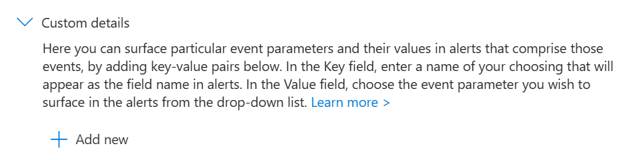
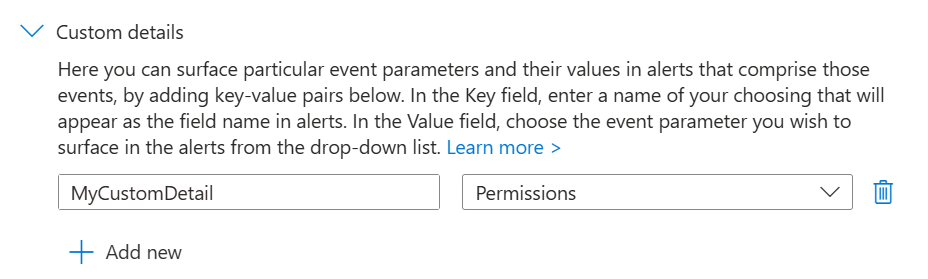

# Update an Analytic Rule's Custom Details

This page contains instructions to update or configure custom details for an analytic rule in Sentinel.

## What are Custom Details

Custom details are a feature of Sentinel Analytic Rules which allow you to surface event details into the alert data. Event details are the values from columns in the query result. These custom details can be used to provide additional context to analysts, group incidents in incident grouping as well as adding additional information for automations to work off.

More details can be found at the [Microsoft Documentation](https://learn.microsoft.com/en-us/azure/sentinel/surface-custom-details-in-alerts?tabs=azure) page for custom details.

## Instructions

1. Go to the affected **Sentinel** workspace.

    If you are unsure where to find your workspaces, visit this link -> [https://portal.azure.com/sentinel](https://portal.azure.com/#browse/microsoft.securityinsightsarg%2Fsentinel).

1. Once you have selected your Sentinel workspace, on the left hand side of the screen, navigate to **Configuration** -> **Analytics**.

    (You may need to expand the sub-menus).

1. **Search** for and **select** the affected **analytic rule**.

1. Click on the **Edit** button.

    If the rule fly-out menu is not opening when selecting the rule, go to the right of the rule and click on the **3 dots button** -> **Edit**.

1. Locate the **Alert enhancement** section and expand the **Custom details** sub-section.

    

1. Next, add any custom details which are desired.

    To add custom details, click on the **Add new** button, enter the name of the custom detail and then select the column to map the custom detail to. Repeat this for all desired custom details.

    

1. Select the **Review + create** tab.

    

1. At the *bottom of the page* -> click on the **Save button** to save the changes to the analytic rule.
