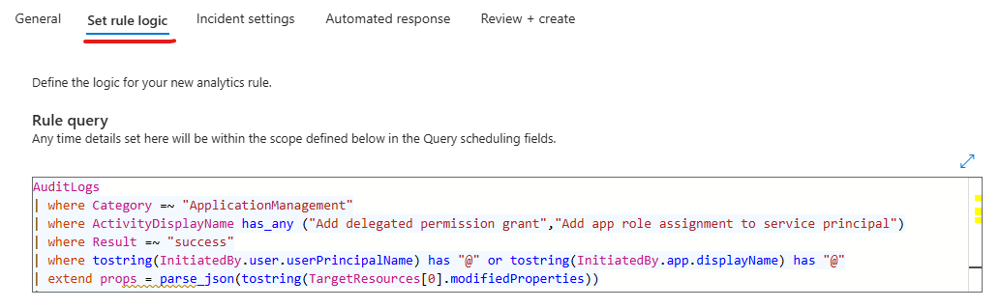
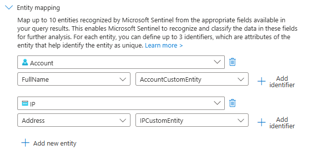
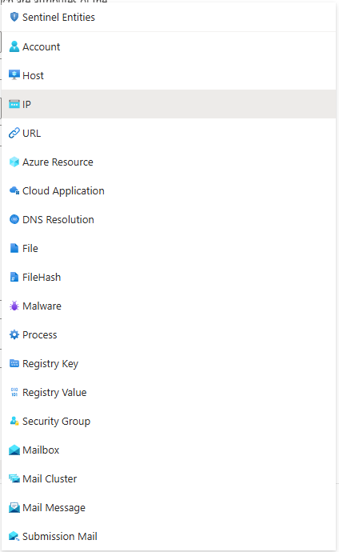

# Update an Analytic Rule Entity Mapping
This page contains instructions on how to update an analytic rule's entity mapping and also provide information to configure basic entity mapping if it's not already configured.

## What is Entity Mapping
Entity mapping is a feature of Sentinel Analytic Rules that allows column data to be mapped to different types of entities. This feature is useful for providing context to alerts / incidents.

There are different entity types such as `Account`, `IP`, `Process` and `File`. Each entity type will have different identifiers that you can map to it, for example `IP` has the `Address` identifier and `Account` has the `Sid` identifier. **The identifiers are associated with a column in the KQL query**. For example, the *IP entity will have the Address identifier mapped to a column of SourceIPAddress*.

## Instructions
1. Go to the affected **Sentinel** workspace.

    If you are unsure where to find your workspaces, visit this link -> [https://portal.azure.com/sentinel](https://portal.azure.com/#browse/microsoft.securityinsightsarg%2Fsentinel).

2. Once you have selected your Sentinel workspace, on the left hand side of the screen, navigate to **Configuration** -> **Analytics**.
    
    (You may need to expand the sub-menus).

3. **Search** for and **select** the affected **analytic rule**. 

4. Click on the **Edit** button.

    If the rule fly-out menu is not opening when selecting the rule, go to the right of the rule and click on the **3 dots button** -> **Edit**.

5. Select the **Set rule logic** tab.

    

6. Locate the **Alert enhancement** -> **Entity mapping** section.

    Here is the section where you will define the entity mapping for the analytic rule. Combinations of 3 entities are typically best; However, if you map more than 3, it is best to refine the incident grouping settings to ensure you either don't over group on all entities and only group on the essential entities.  

    

    

    Microsoft provides a [reference page](https://learn.microsoft.com/en-us/azure/sentinel/entities-reference) for different types of entities you can map and their associated identifiers.

7. Configure the entity mapping based on the detection rule needs.

7. Select the **Review + create** tab.  

    

8. At the *bottom of the page* -> click on the **Save button** to save the changes to the analytic rule.