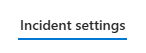
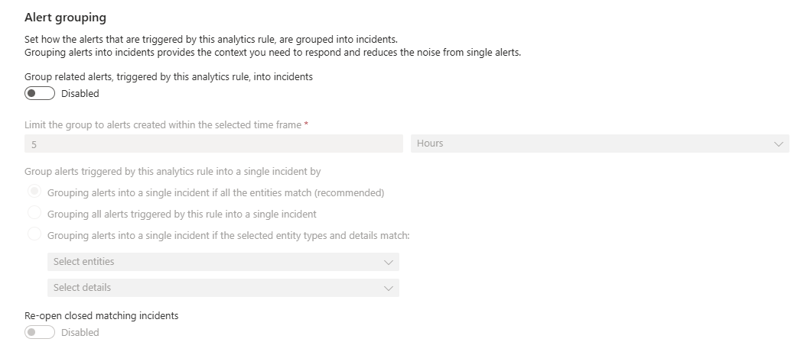
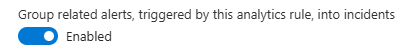
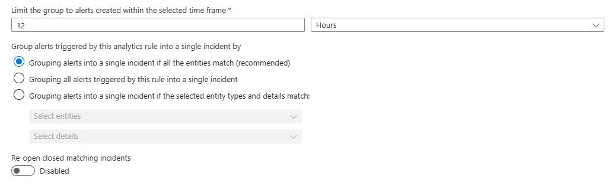
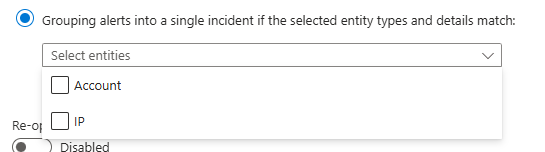
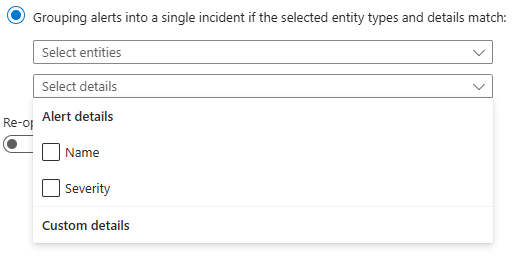
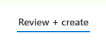

# Updating a Sentinel Analytic Rule Incident Grouping

This page contains instructions to update an analytic rule's incident grouping settings. By configuring incident grouping for an analytic rule, you can significantly reduce incident queue noise by grouping the same alerts into one incident.

## What is Incident Grouping

Sentinel provides a feature for analytic rules called Incident Grouping which allows multiple alerts to be grouped into a single incident. This is feature is useful for reducing incident queue noise by grouping the same alerts into a single incident.

Incident grouping works by matching on entities, alert details or custom details, all of which are configurable in the analytic rule incident grouping settings.

## Instructions

1. Go to the affected **Sentinel** workspace.

    If you are unsure where to find your workspaces, visit this link -> [https://portal.azure.com/sentinel](https://portal.azure.com/#browse/microsoft.securityinsightsarg%2Fsentinel).

1. Once you have selected your Sentinel workspace, on the left hand side of the screen, navigate to **Configuration** -> **Analytics**.

    (You may need to expand the sub-menus).

1. **Search** for and **select** the affected **analytic rule**.

1. Click on the **Edit** button.

    If the rule fly-out menu is not opening when selecting the rule, go to the right of the rule and click on the **3 dots button** -> **Edit**.

1. Select the **Incident settings** tab.\
    

1. Locate the **Alert grouping** section of the **Incident settings** tab.

    *If alert grouping is not configured*, it will look like this.\
    

1. Locate the **Group related alerts, triggered by this analytics rule, into incidents** button.

    If the button is disabled then *click the button to enable alert grouping*.\
    

1. Next you will need to configure the alert grouping settings.

    The settings should ideally be configured based on the recommended setting which is all entities. However, certain types of entities and entity mapping combinations can be problematic.

    For example, if you only have a single entity mapped, say the IP Address entity, if the IP Address is your corporate NAT IP then there is potential for all of the alerts to be grouped into the same incident, even if they have no relevance to each other.

    The recommended settings can be seen in the image below.\
    

    Alert grouping can also be granularly set based on the entity types which are mapped, as well as different alert and custom details.

    \
    

    The **Re-open closed matching incidents** setting should always be **disabled**. If this setting is enabled, it has a high potential to interfere with your incident queue by re-opening already triaged incidents and grouping with incidents that they shouldn't be.

1. Select the **Review + create** tab.

    

1. At the *bottom of the page* -> click on the **Save button** to save the changes to the analytic rule.
