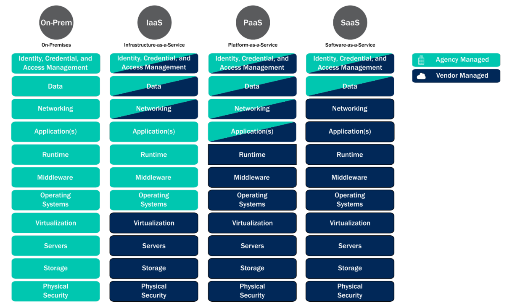

# Baseline for Event Ingestion

This document and associated checklist is intended to be used as a high-level self assessment to determine coverage quality of an operational SIEM environment for a typical organisation.

## 1. Service Model Context

Most organisations are strategically migrating services not unique to their specific business to shared common service models as below (diagram from [CISA Cloud Security Technical Reference Architecture](https://www.cisa.gov/sites/default/files/publications/Cloud%20Security%20Technical%20Reference%20Architecture.pdf)). This typically results in the **Identity, Credential and Access Management** and **Data** relevant observables having the greatest value.

The above diagram should be used as a reference to determine which systems/services are relevant for capturing security logs (i.e. if utilising IaaS, the service provider should facilitate the collection of security logs in bulk, while On-Premise infrastructure would require additional resoruces to capture security logs from hypervisors, physical servers, storage and physical security).

## 2. Detection Observables

Referencing the [STIX 2.1 Cyber Observable Objects](https://stix2.readthedocs.io/en/latest/api/v21/stix2.v21.observables.html) library, the below observables are intended to represent an organisation detection scope of potential threat indicators. The observables objects are ordered based on feasibility of ingestion of all relevant activities external to an organisation.

1. [IPv4Address](https://stix2.readthedocs.io/en/latest/api/v21/stix2.v21.observables.html#stix2.v21.observables.IPv4Address), [IPv6Address](https://stix2.readthedocs.io/en/latest/api/v21/stix2.v21.observables.html#stix2.v21.observables.IPv6Address)
2. [UserAccount](https://stix2.readthedocs.io/en/latest/api/v21/stix2.v21.observables.html#stix2.v21.observables.UserAccount), [EmailAddress](https://stix2.readthedocs.io/en/latest/api/v21/stix2.v21.observables.html#stix2.v21.observables.EmailAddress)
3. [DomainName](https://stix2.readthedocs.io/en/latest/api/v21/stix2.v21.observables.html#stix2.v21.observables.DomainName), [URL](https://stix2.readthedocs.io/en/latest/api/v21/stix2.v21.observables.html#stix2.v21.observables.URL)
4. [EmailMessage](https://stix2.readthedocs.io/en/latest/api/v21/stix2.v21.observables.html#stix2.v21.observables.EmailMessage) (date, subject, from, to most relevant)
5. [File](https://stix2.readthedocs.io/en/latest/api/v21/stix2.v21.observables.html#stix2.v21.observables.File) (SHA256 hash most relevant)
6. [HTTPRequestExt](https://stix2.readthedocs.io/en/latest/api/v21/stix2.v21.observables.html#stix2.v21.observables.HTTPRequestExt) (Inbound HTTP requests through e.g. Web Application Firewalls)

> Futher information of the purpose of STIX 2.1 and the observable objects can be found [here](https://oasis-open.github.io/cti-documentation/stix/intro.html).

## 3. Detection Assets

The below is a high level summary of assets and services from where security logs should typically be collected. Subsequent detection queries will refer to these assets.

- **Users** - Identity Services (On Premise and SaaS), Application access
- **Mailboxes** - Email mailboxes and associated inbound/outbound flows
- **Endpoints** - Devices that users access organisational resources from
- **Servers** - Hypervisors, Servers, Container Platforms
- **Network Firewalls (Firewalls)** - Network egress and internal network control points
- **Web Application Firewalls (WAFs)** - Network ingress control points

## 4. Detection Checklist

The below checklist should be undertaken by the organisations security team to calculate the percentage coverage of assets (e.g. 8 / 10 Endpoints == 80% coverage) for a given log retention window (normally 12 months). This data is heavily used for threat hunting activities.

### 4.1. Excellent return on investment

These are available as out of the box integrations on fully SaaS platforms such as [Microsoft Sentinel connected to Microsoft 365 Defender](https://learn.microsoft.com/en-us/azure/sentinel/connect-microsoft-365-defender?tabs=MDE). On-Prem sign-ins depending on the [Defender for Identity](https://learn.microsoft.com/en-us/defender-for-identity/capacity-planning) require sensor deployment on all Domain Controllers (minimum version Windows Server 2012).

- [ ] **Users** - Query a `IPv4Address`, `IPv6Address`, `Protocol` or `User-Agent (HTTPRequestExt)` across all [Network Traffic](https://attack.mitre.org/datasources/DS0029/) for HTTPS sign ins.
  - E.g. [Sign-in logs in Azure Active Directory](https://learn.microsoft.com/en-us/azure/active-directory/reports-monitoring/concept-all-sign-ins).
- [ ] **Users** - Query a `IPv4Address`, `IPv6Address` or `Protocol` across all [Network Traffic](https://attack.mitre.org/datasources/DS0029/) for On-Prem sign ins.
  - E.g. [Defender for Identity](https://learn.microsoft.com/en-us/defender-for-identity/architecture).
- [ ] **Mailboxes** - Email events and URL / attachment analysis using mail server [Application Logs](https://attack.mitre.org/datasources/DS0015/).
  - E.g. [Defender for Office 365](https://learn.microsoft.com/en-us/microsoft-365/security/office-365-security/defender-for-office-365?view=o365-worldwide#microsoft-defender-for-office-365-plan-1-and-plan-2)
  - [ ] Query a `DomainName` or `EmailAddress` across all emails.
  - [ ] Query a `Subject (EmailMessage)` across all emails.
  - [ ] Query a `DomainName` or `URL` across all links inside emails.
  - [ ] Query a `SHA256 Hash (File)` across all attachments inside emails.

### 4.2. Very high return on investment

These are available as integrations with some deployment requirements on Windows, macOs and Linux endpoints using [Microsoft Defender for Endpoint](https://learn.microsoft.com/en-us/microsoft-365/security/defender-endpoint/microsoft-defender-endpoint?view=o365-worldwide).

- [ ] **Endpoints** - Query a `IPv4Address`, `IPv6Address`, `DomainName` or `URL` across all outbound [Network Traffic](https://attack.mitre.org/datasources/DS0029/).
  - E.g. [Defender Network Protection](https://learn.microsoft.com/en-us/microsoft-365/security/defender-endpoint/network-protection?view=o365-worldwide), [Defender Web Protection](https://learn.microsoft.com/en-us/microsoft-365/security/defender-endpoint/web-protection-overview?view=o365-worldwide)
- [ ] **Endpoints** - Query a `SHA256 Hash (File)`, `Name (File)` or `FileOriginUrl (File)` across all [Files](https://attack.mitre.org/datasources/DS0022/) and [Processes](https://attack.mitre.org/datasources/DS0009/).
  - E.g. [Defender Real-time protection](https://learn.microsoft.com/en-us/mem/intune/protect/antivirus-microsoft-defender-settings-windows#real-time-protection)

### 4.3. High return on investment

Agent based network protection is relatively straightforward to ingest from application servers. High volume network traffic should be reviewed prior to ingestion to understand the volume of events and to avoid loading large quantites of low value events (such as Content Delivery Networks / File Sharing / Media Streaming logs).

- [ ] Query an `IPv4Address`, `IPv6Address` or `DomainName` across all inbound/outbound [Network Traffic](https://attack.mitre.org/datasources/DS0029/).
  - [ ] **Servers** - e.g. [Defender Network Protection](https://learn.microsoft.com/en-us/microsoft-365/security/defender-endpoint/network-protection?view=o365-worldwide)
  - [ ] **Firewalls** - e.g. [Sentinel 3rd party connectors](https://github.com/Azure/Azure-Sentinel/tree/master/Solutions)
- [ ] **WAFs** - Query a `IPv4Address`, `IPv6Address`, `URL` or `User-Agent (HTTPRequestExt)` across all inbound [Network Traffic](https://attack.mitre.org/datasources/DS0029/).
  - E.g. [Azure Front Door logs](https://learn.microsoft.com/en-us/azure/frontdoor/standard-premium/how-to-logs)

## 5. Detection Analytics

Once the above checklist is validated, an organisation should schedule regular security exercises to detect for suspicious behaviour based on indicators collected from threat intelligence soruces and to detect for deviations against known behaviour baselines. A simple example would be to determine a subset of users that are allowed to use legacy authentication protocols (NTLM, LDAP, HTTP Basic Auth), and alerting security analysts whenever a user outside of that list attempts to sign in with a legacy authentication protocol.
