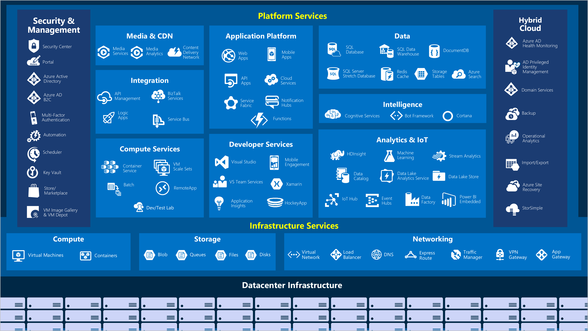

# SOC Analyst Induction

## 1. Overview

The below guidance is to get a novice with basic IT literacy up to speed with common Security Operations activities all the way from collecting events, alerting on detections, triaging alerts, responding to incidents and managing detection rules and investigative queries.

## 2. Prerequisites

To get started with SOC activities in the Microsoft Sentinel environment it is sensible to have administrative access to both a [Microsoft 365](https://www.microsoft.com/en-au/microsoft-365) tenant and a [Microsoft Azure](https://azure.microsoft.com/en-au/) subscription.

There are developer/student versions available for free that should be sufficient for the training exercises below:

- [Microsoft 365 Developer Program](https://developer.microsoft.com/en-us/microsoft-365/dev-program) - Free for anyone with a mobile number, no credit card required.
- [Azure for Students](https://azure.microsoft.com/en-au/free/students/) - Free for anyone with an edu email address, no credit card required.
- [Azure free account](https://azure.microsoft.com/en-au/free/) - Free for anyone with a credit card verification step, no ongoing payment required.
- [JupyterLab Desktop](https://github.com/jupyterlab/jupyterlab-desktop) - Free desktop tool for python notebooks to complete security research and investigations.

Please use the above links or existing services to organise yourself admin access, then work through the training below.

## 3. Recommended structured learning approach

The below training and certifications are all free, and provide a good foundational base for cyber security defensive activities. It's recommended to work through them in order.

### 3.1. IT Infrastructure and Cloud fundamentals

Most IT services are delivered as layers ontop of several supporting services.

To secure a modern public cloud start with understanding shared security responsibility models. It is crucial to understand where to effectively apply investment (i.e. where to focus security resources) to ensure a useful outcome.

If you are relatively new to public cloud services and/or IT infrastructure, please start with the [Azure Fundamentals (AZ-900)](https://docs.microsoft.com/en-us/certifications/azure-fundamentals/) and [Security, Compliance, and Identity Fundamentals (SC-900)](https://docs.microsoft.com/en-us/certifications/security-compliance-and-identity-fundamentals/) certifications.

### 3.2. Security Operations Basics

Learn the basics of triaging and responding to incidents, including collaboration with organisational stakeholders.

1. [Microsoft Security Operations Analyst (SC-200)](https://docs.microsoft.com/en-us/certifications/exams/sc-200) certification
2. [Cybrary MITRE ATT&CK Defender (MAD)](https://app.cybrary.it/browse/course/mitre-attack-defender-mad-attack-for-cyber-threat-intelligence) training

#### 3.2.1. Documentation, Programming and scripting fundamentals

Learn how to create documentation in markdown, keep track of your work in git, code in python and automate tasks in powershell. Developing good documentation skills, and having a good grasp of coding and scripting significantly enhances your abilities to compose information and orchestrate computers, both excellent skills to have in your toolbelt as a security professional.

1. [Basic writing and formatting guide (GitHub Markdown)](https://docs.github.com/en/get-started/writing-on-github/getting-started-with-writing-and-formatting-on-github/basic-writing-and-formatting-syntax) - use markdown docs in git repos for managing code, detection rules, investigation evidence.
2. [Hello. World (GitHub Docs)](https://docs.github.com/en/get-started/quickstart/hello-world) - use git to manage all your work and track who has changed what. [Git, GitHub, & GitHub Desktop for beginners - YouTube](https://www.youtube.com/watch?v=8Dd7KRpKeaE) for those who prefer video tutorials.
3. [Python lessons 1-20 (Code with Vincent)](https://www.youtube.com/watch?v=r0cGhyzFzco&list=PLEcHbCIBlyJryQxxElze2C_xMHLAJW94C&index=3) - if you are new to programming this will get you up to speed with variables, functions, conditional statements, loops, lists, dictionaries, objects, interfaces
4. [Automate administrative tasks by using PowerShell](https://docs.microsoft.com/en-us/learn/paths/powershell/) - learn to run commands, how to learn more about PowerShell and it's modules and additionally to create and run script files.
5. [How to ask Technical Questions (Princeton)](https://princetonuniversity.github.io/PUbootcamp/sessions/technical-questions/HowToAskQuestions2018Bootcamp.pdf) - once you are dealing with complex technical activities, having a good approach for understanding where to look next for assistance is a very useful skill.

#### 3.2.2. Creating and securing public cloud workloads

Please work through the [Azure VM](azure-basics.md) excercises to familiarise yourself with the tools that would typically be used to build and run a secure cloud workload as a VM exposed to the internet.

#### 3.2.3. Security Investigations with Python Notebooks

Connect to SIEM tools from python notebooks (also known as Jupyter Notebooks), and use pandas to interrogate, analyse and report on datasets at scale. Keeping track of advanced investigative activities in python notebooks is a good way to share complex procedures in an open, repeatable, refinable format that can be rapidly re-used for subsequent investigations.

1. [Connect to Azure Sentinel from pandas (Infosec Jupyter Notebook)](https://infosecjupyterbook.com/use-cases/data-connectors/azure_sentinel.html) jupyterbook guide

1. [10 minutes to pandas (pandas documentation)](https://pandas.pydata.org/pandas-docs/stable/user_guide/10min.html) user guide

1. [Revise Hunt for Threats (SC-200) using Jupyter Desktop](https://docs.microsoft.com/en-us/learn/modules/perform-threat-hunting-sentinel-with-notebooks/)

Once you have a handle on developing the above notebooks, you should be able to export some data from your tools and rapidly assess it using community threat intelligence resources such as:

- [urlscan.io](https://urlscan.io/) - Website scanner for suspicious and malicious URLs.
- [VirusTotal](https://www.virustotal.com/gui/home/upload) - Analyze suspicious files, domains, IPs and URLs to detect malware and other breaches, automatically share them with the security community.
- [AbuseIPDB](https://www.abuseipdb.com/) - central repository of IP abuse reports.
- [Shodan](https://www.shodan.io/) - details of internet connected devices updated weekly.

### 3.3. Skill Check - Develop a Security Notebook

Develop a security notebook that reads security event data from a local csv and check the entities/indicators/observables against a community api such as [urlscan.io](https://urlscan.io/docs/api/) or [VirusTotal](https://developers.virustotal.com/reference/overview) to validate if there is any known sources of concern.

- Develop your security investigative notebooks in a git repository to share with your team.
- Test with known malicious indicators to validate they work.
- Include usage documentation for your notebook in markdown in your git repository.

### 3.4. Cheatsheets

The below one pagers are great to print out and use as reference material while familiarising yourself with tools.

- [Regular Expressions](https://cheatography.com/davechild/cheat-sheets/regular-expressions/pdf/) - regex including symbols, ranges, grouping, assertions and some sample patterns to get you started.
- [Kusto Query Language (KQL)](https://github.com/marcusbakker/KQL/blob/master/kql_cheat_sheet.pdf) - queries mainly focused on the [SecurityEvent](https://docs.microsoft.com/en-us/azure/azure-monitor/reference/tables/securityevent) table.
- [Python](https://cheatography.com/davechild/cheat-sheets/python/) - one-page reference sheet for the Python programming language.
- [Pandas](https://pandas.pydata.org/Pandas_Cheat_Sheet.pdf) - Data Wrangling with pandas Cheat Sheet.

### 3.5. Microsoft tooling in depth

For those using a Microsoft toolset the below guides have in-depth details on operating a SIEM, managing security across microsoft tools, and securely operating systems on Microsoft Azure. The [WA SOC](https://www.wa.gov.au/organisation/department-of-the-premier-and-cabinet/office-of-digital-government/cyber-security-unit) maintains the [WA SOC Microsoft Sentinel Connector Guidance](https://github.com/wagov/soc-onboarding/blob/main/Sentinel-Connector-Guidance.md) intended to be a guided path to achieving good security coverage using primarily Microsoft Sentinel as a SIEM.

#### 3.5.1. Understanding Kusto Query Language (KQL)

The below two resources are a good starting point for understanding KQL in addition to the [Microsoft KQL Overview](https://learn.microsoft.com/en-us/azure/data-explorer/kusto/query/).

1. [KQL Overview](https://www.youtube.com/watch?v=Pl8n6GaWEo0) Overview video of the whole language (1 hour).
2. [Must Learn KQL](https://github.com/rod-trent/MustLearnKQL) A blog/book/video channel.
3. [Kusto Detective Agency](https://detective.kusto.io/inbox) Use KQL as an investigation tool as part of a virtual agency with cases.

1. [Become a Microsoft Sentinel Ninja: The complete level 400](https://techcommunity.microsoft.com/t5/microsoft-sentinel-blog/become-a-microsoft-sentinel-ninja-the-complete-level-400/ba-p/1246310) training
1. [Cybersecurity Architect Expert (SC-100)](https://docs.microsoft.com/en-us/certifications/cybersecurity-architect-expert/) certification - design forward-looking strategies for security, governance, risk, compliance covering users, workstations, infrastructure, data and applications.

### 3.6. Public cloud tooling in depth

Several other cloud providers have operational security training that is designed for easy adoption on their platforms, relevant certifications of interest are below (note there is high overlap between cloud providers, so the microsoft training above should make the below learning paths much easier to complete).

1. [AWS Skill Builder - Security Learning Plan](https://explore.skillbuilder.aws/learn/public/learning_plan/view/91/security-learning-plan) leads to [AWS Certified Security - Specialty](https://aws.amazon.com/certification/certified-security-specialty/)

1. [Oracle become a cloud security professional](https://mylearn.oracle.com/learning-path/become-a-cloud-security-professional/108608) leads to [Oracle Cloud Infrastructure 2022 Security Professional 1Z0-1104-22](https://education.oracle.com/en/oracle-cloud-infrastructure-2022-certified-security-professional/trackp_OCIS2022CP)

1. [Google Security Engineer learning path](https://cloud.google.com/training/networking-security/#security-engineer-learning-path) leads to [Google Professional Cloud Security Engineer](https://cloud.google.com/certification/cloud-security-engineer)

