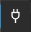
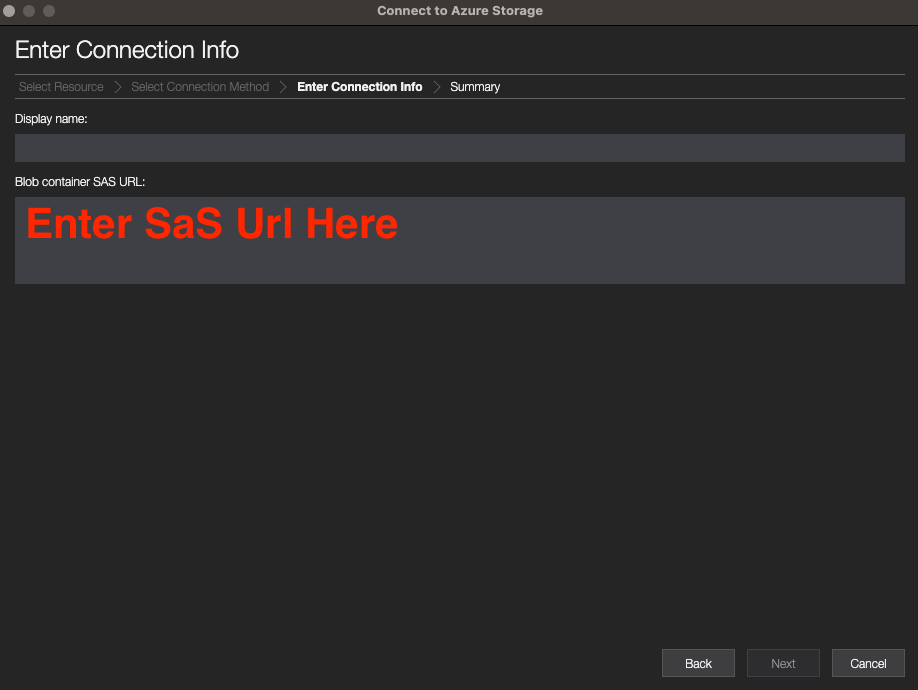
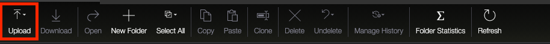

# Collecting Evidence

During incident response activities, organisations may need to share evidence. Below is a process using [Azure Storage Explorer](https://docs.microsoft.com/en-us/azure/vs-azure-tools-storage-manage-with-storage-explorer) to do this securely.

## Creating a blob container to receive evidence

1. Review the following documentation in the creation of a [blob container](https://docs.microsoft.com/en-us/azure/storage/blobs/storage-quickstart-blobs-portal#create-a-container) using [Azure Storage Explorer](https://docs.microsoft.com/en-us/azure/storage/blobs/quickstart-storage-explorer).
1. Create a [shared access signature (SAS) token](https://docs.microsoft.com/en-us/azure/storage/blobs/quickstart-storage-explorer#generate-a-shared-access-signature) ready to share with relevant external organisations.

## Uploading evidence to a blob container securely using a SAS URL

1. Connect to the provided [blob container securely using a SAS url](https://docs.microsoft.com/en-us/azure/vs-azure-tools-storage-manage-with-storage-explorer?toc=%2Fazure%2Fstorage%2Fblobs%2Ftoc.json&tabs=windows#attach-to-an-individual-resource)
1. In the Select **Resource panel** of the Connect to **Azure Storage dialog**, select the **Blob Container** resource.

1. Select **Shared access signature url (SAS)** and select **Next**.

1. Enter a display name for your connection and the SAS URI for the resource. Select Next.

1. Review your connection information in the Summary panel. If the connection information is correct, select **Connect**.
1. Once connected, select **Upload** to upload the evidence to the container, and let the container owner know.

