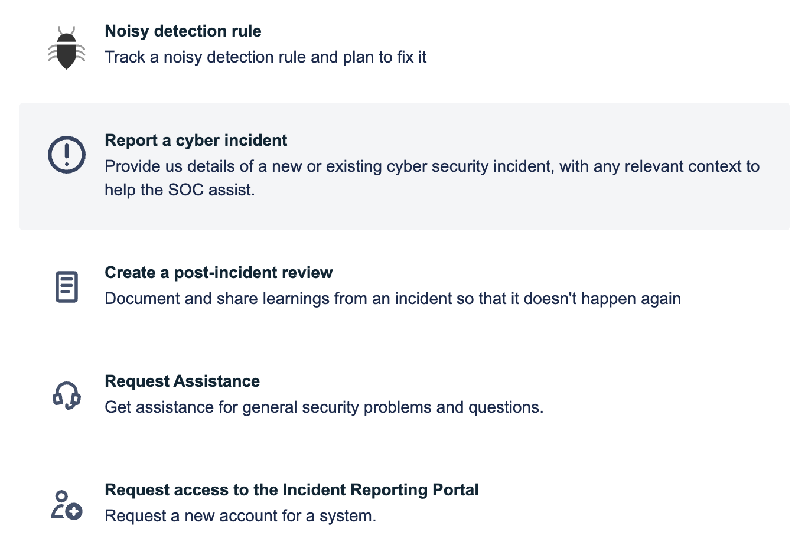

# WA SOC Incident Reporting Portal (IRP)

## 1. Overview

The cyber security incident reporting portal provides a secured login for each Western Australian government agency to:

- report cyber incidents
- enable coordination of incident response
- receive updates on ongoing cyber security events and topics

## 2. Getting access

- Agencies can request access by emailing cybersecurity@dpc.wa.gov.au.
- Agencies with existing access can use the [Request access to the Incident Reporting Portal](https://wasoc.atlassian.net/servicedesk/customer/portal/2/group/1/create/8) WASOC IRP form.

### 2.1. Logging in to the WASOC IRP

The [WA Security Operations Centre - IRP](https://wasoc.atlassian.net/servicedesk/customer/portals "https://wasoc.atlassian.net/servicedesk/customer/portals") is accessible using any modern browser.

When logging in you will be prompted to use Single Sign On, please do this and **Continue with Microsoft** for your Atlassian Identity.

## 3. Creating a Cybersecurity Incident

- [Report a cyber incident](https://wasoc.atlassian.net/servicedesk/customer/portal/2/group/1/create/19) - WASOC IRP form
  - Enter the details of your incident
  - Select **Share with** your organisation
- SIEM Sentinel incidents will be automatically integrated with the IRP for monitored customers.
- To manage alerting and integrations, please use the [Request Assistance](https://wasoc.atlassian.net/servicedesk/customer/portal/2/group/1/create/1) WASOC IRP form

## 4. Managing your Cybersecurity Incidents

You can view all of your security teams incidents on the [Requests page](https://wasoc.atlassian.net/servicedesk/customer/user/requests?page=1&reporter=all) in the WASOC IRP.

The below actions can be taken on your incidents, noting that all standard activities (classification, severity, labeling, comments) should be able to be undertaken in your SIEM and automatically synced to the IRP.

- Search existing incidents by summary, description or entities
- Add comment/ updates to an Incident
  - If you add comments in your SIEM they will sync automatically
  - Attachments and Non-SIEM Incidents can be directly commented on in the portal
- Request assistance
- Create a post-incident review
  - The WA SOC can review your PIR and provide additional context as needed

### 4.1. Managing your SIEM Sentinel Analytic Rules

If your team is seeing a lot of false positive detections, please review [Handle false positives in Microsoft Sentinel
](https://docs.microsoft.com/en-us/azure/sentinel/false-positives) and reach out to the SOC using [Request Assistance](https://wasoc.atlassian.net/servicedesk/customer/portal/2/group/1/create/1) for further advice.

## 5. General security advice

For any other SIEM advice, general security problems and questions don't hesitate to reach out to the SOC using [Request Assistance](https://wasoc.atlassian.net/servicedesk/customer/portal/2/group/1/create/1). For any urgent incidents please call us on Teams or via phone.

## 6. Monthly Reporting

The below aggregate statistics are being captured by the new portal and will be available in the SOC monthly reports for your organisation.

- Incident statistics
  - Total Detections
  - Triage types (automated, manual)
  - True / False / Benign breakdown
- MITRE tactics & techniques breakdown
- SIEM ingested event coverage by table
- Detection effectiveness by rule
