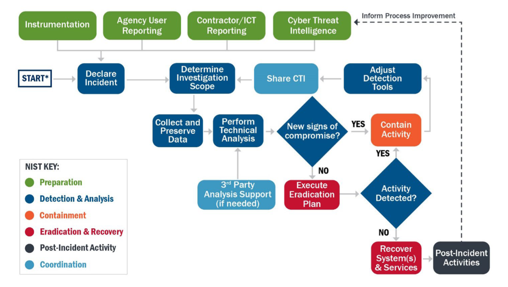
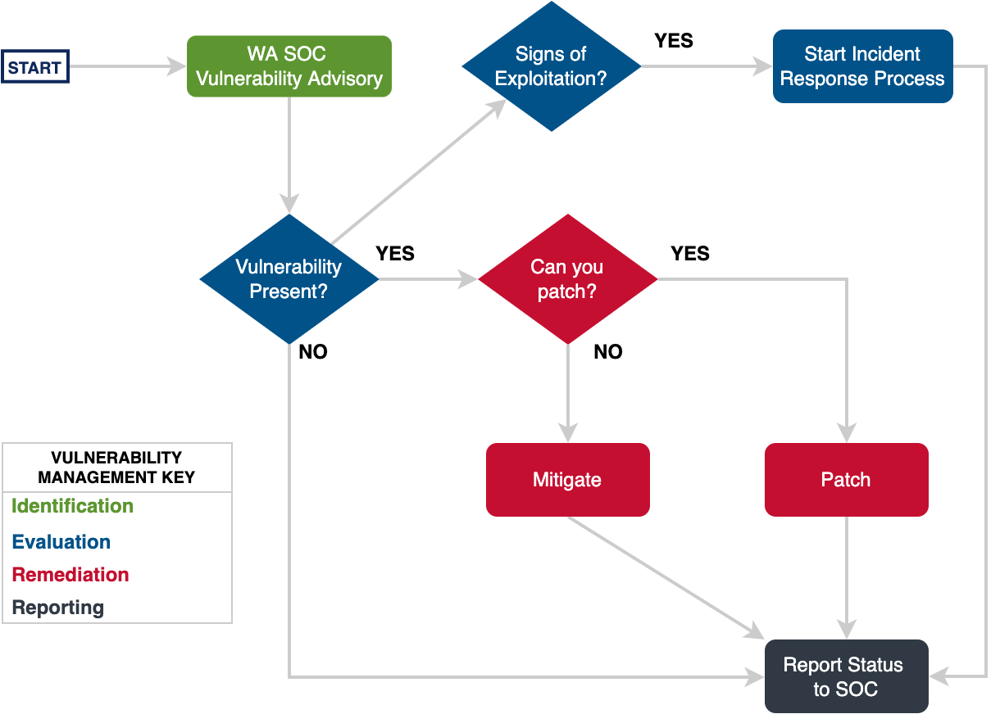

# WA SOC Playbooks

Over time the WA SOC is establishing a set of playbooks, primarily focused on incident response that are suitable for cyber security teams with operational processes aligned to the [CISA Cybersecurity Incident and Vulnerability Response Playbooks (508C)](pdfs/Federal_Government_Cybersecurity_Incident_and_Vulnerability_Response_Playbooks_508C.pdf)

## Triage & Investigation

Under Review

## Incident Response

## Vulnerability Response

## Threat Hunting

Under Review

## Digital Forensics

Under Review, see [Collecting Evidence](collecting-evidence.md)
