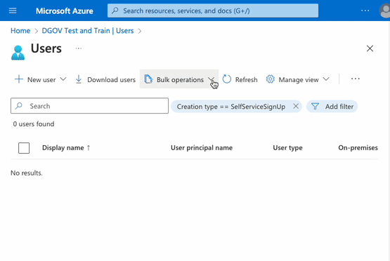
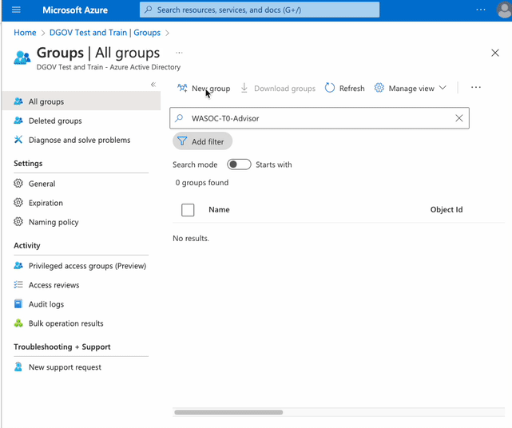
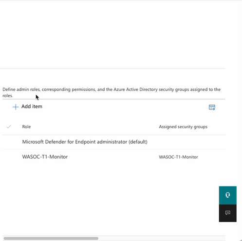
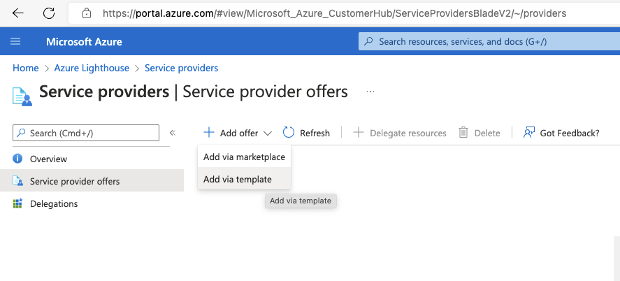
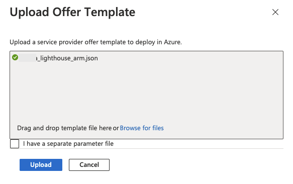
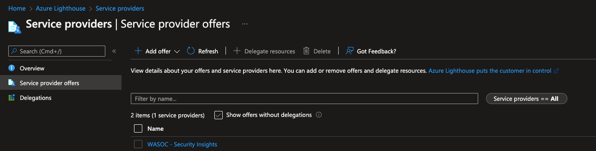

# WA SOC Onboarding Procedure

## 1. Overview

There are 2 delegations of access an operational security team would need to assist a customer with managing their security events and detection rules. Our customer offerings below have been constructed around the type of ongoing access and assistance required:

- **Tier 0 - Advisor:** Ability for automation accounts to read security incidents, alerts, identity and device information, event data, and azure subscription resources.
  - Microsoft 365 Tenant (Azure AD) Role: [Global Reader](https://docs.microsoft.com/en-au/azure/active-directory/roles/permissions-reference#global-reader)
  - Azure Subscription Role: [Reader](https://docs.microsoft.com/en-us/azure/role-based-access-control/built-in-roles#reader)
- **Tier 1 - Monitor:** Increased access for analysts to work on security incidents and detection rules ontop of **Tier 0**.
  - Microsoft 365 Tenant (Azure AD) Roles: [Global Reader](https://docs.microsoft.com/en-au/azure/active-directory/roles/permissions-reference#global-reader), [Security Operator](https://docs.microsoft.com/en-us/azure/active-directory/roles/permissions-reference#security-operator)
  - Azure Subscription Roles: [Reader](https://docs.microsoft.com/en-us/azure/role-based-access-control/built-in-roles#reader), [Microsoft Sentinel Contributor](https://docs.microsoft.com/en-us/azure/role-based-access-control/built-in-roles#microsoft-sentinel-contributor), [Security Admin](https://docs.microsoft.com/en-us/azure/role-based-access-control/built-in-roles#security-admin)
  - Optional configuration of [Azure AD Privileged Identity Management](https://docs.microsoft.com/en-us/azure/active-directory/privileged-identity-management/pim-configure) (PIM) for elevated access to resources during critical incident response or service configuration activities (required under **Tier 2**).

### 1.1. Azure Subscription access

As part of onboarding, the WA SOC will send the customer a prefilled [Azure Lighthouse ARM Deployment](https://docs.microsoft.com/en-us/azure/lighthouse/how-to/onboard-customer#create-your-template-manually) that can be installed as an **Service provider offer** to initiate an [Azure Lighthouse](https://docs.microsoft.com/en-us/azure/lighthouse/overview) connection between the customer Azure Subscription and the WA SOC Tenant. Once completed the WA SOC can delegate relevant permissions to analysts and automation processes via privileged groups in the WA SOC tenant, allowing it to service the customers Azure subscription. This process needs to be undertaken for each subscription the customer would like to delegate access to.

### 1.2. Microsoft 365 tenant access

As part of onboarding, the WA SOC will send the customer a list of analysts (in csv format) to be delegated specific access in the customers  Azure AD Tenant. This process needs to be undertaken for each Azure AD Tenant the customer would like to delegate access to.

## 2. Onboarding Process

### 2.1. Prerequisites

- [Global Admin](https://docs.microsoft.com/en-us/azure/active-directory/roles/permissions-reference#global-administrator) permission required for the Azure AD Tenant and associated Azure Subscriptions.
  - [Access to Service provider offers](https://portal.azure.com/#view/Microsoft_Azure_CustomerHub/ServiceProvidersBladeV2/~/providers) in the Azure Portal
  - [Access to Azure Active Directory Groups](https://portal.azure.com/#view/Microsoft_AAD_IAM/GroupsManagementMenuBlade/~/AllGroups) in the Azure Portal
- List of agency Azure AD Identities (as emails) that will require access to the WA SOC Incident Reporting Portal for collaboration on cyber security incidents.

### 2.2. Microsoft 365 tenant access delegation

The below Azure AD group and Defender for Endpoint roles grant permissions required from the customer tenant to the WA SOC analysts. Once you have reviewed the roles themselves please implement using the [2.2.3. Group and role assignment walkthrough](#223-group-and-role-assignment-walkthrough).
> Note that the Defender for Endpoint role assignment is only required if you have enabled [Manage portal access using role-based access control](https://docs.microsoft.com/en-us/microsoft-365/security/defender-endpoint/rbac?view=o365-worldwide#before-you-begin) in [Defender for Endpoint](https://security.microsoft.com/preferences2/user_roles).

#### 2.2.1. Tier 0 Azure AD Group & Defender for Endpoint Roles

Create an Azure AD group as follows. Any future changes to membership will be requested by the WA SOC.

- **Group type:** Security
- **Group name:** WASOC-T0-Advisor
- **Group description:** WASOC Tier 0 Advisor Access (Global Reader)
- **Azure AD roles can be assigned:** Yes
- **Members:** Each email address imported from `wasoc-automation-invites.csv`
- **Roles:** [Global Reader](https://docs.microsoft.com/en-au/azure/active-directory/roles/permissions-reference#global-reader)

Create a Defender for Endpoint role as follows. This will inherit from the above group to ensure membership changes stay in sync.

- **Role Name:** WASOC-T0-Advisor
- **Permissions:** View Data (all)
- **Assigned user groups:** WASOC-T0-Advisor

#### 2.2.2. Tier 1 Azure AD Group & Defender for Endpoint Roles

Create an Azure AD group as follows. Any future changes to membership will be requested by the WA SOC.

- **Group type:** Security
- **Group name:** WASOC-T1-Monitor
- **Group description:** WASOC Tier 1 Monitor Access (Security Operator)
- **Azure AD roles can be assigned:** Yes
- **Members:** Each email address imported from `wasoc-analyst-invites.csv`
- **Roles:** [Global Reader](https://docs.microsoft.com/en-au/azure/active-directory/roles/permissions-reference#global-reader) and [Security Operator](https://docs.microsoft.com/en-us/azure/active-directory/roles/permissions-reference#security-operator)

Create a Defender for Endpoint role as follows. This will inherit from the above group to ensure membership changes stay in sync.

- **Role Name:** WASOC-T1-Monitor
- **Permissions:** View Data (all), Active remediation actions (all), Alerts investigation
- **Assigned user groups:** WASOC-T1-Monitor

#### 2.2.3. Group and role assignment walkthrough

The group names and role names below can be set to anything you prefer, however for consistency we recommend using the templated names above.

1. Invite the `wasoc-...-invites.csv` into your [Azure AD directory](https://portal.azure.com/#view/Microsoft_AAD_UsersAndTenants/UserManagementMenuBlade/~/AllUsers).

2. [Create a single Azure AD Group](https://portal.azure.com/#view/Microsoft_AAD_IAM/AddGroupBlade) with the above invited automation accounts / analysts as members and documented Azure AD roles assigned.

3. Assign the [Defender for Endpoint roles](https://security.microsoft.com/preferences2/user_roles) to the above group to add Defender for Endpoint access if you have enabled role based access control.
  

### 2.3. Azure Subscription access delegation

The Azure subscription access can be delegated via the [Azure Portal](https://docs.microsoft.com/en-us/azure/lighthouse/overview).

Navigate to the [Azure Lighthouse - Service Providers](https://portal.azure.com/#view/Microsoft_Azure_CustomerHub/ServiceProvidersBladeV2/~/providers) page in the Azure portal, and select the arrow next to Add offer, and then select Add via template.

#### 2.3.1. Azure Lighthouse ARM Deployment

Browse for the template provided, and click **Upload**. This can be customised to removed unused groups if desired for the customers Tier - please inform the WA SOC of any changes prior to deployment to allow documentation to be updated.

Review the custom deployment details and ensure the location is Australia East, then click **Review and create** then click **Create**.

## 3. Confirmation of Onboarding

Once the template phase has completed, cusotmers can confirm the onboarding process has finalised by navigating to the [Azure Lighthouse - Service Providers](https://portal.azure.com/#view/Microsoft_Azure_CustomerHub/ServiceProvidersBladeV2/~/providers) page and confirming you can see the **WA SOC - Security Insights** service offer.

