# WA SOC Microsoft Sentinel Connector Guidance

Microsoft Sentinel _Collect => Detect => Investigate => Respond_ overview.

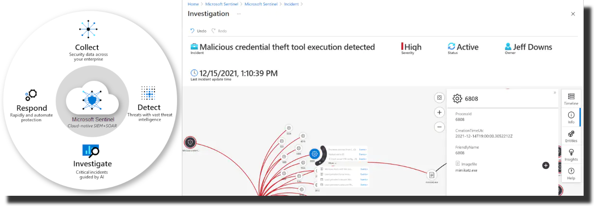

The below guide has been constructed by the WA Security Operations Centre (SOC) to prioritise connectors and configuration based on cost and complexity. There are several [free data sources](https://docs.microsoft.com/en-us/azure/sentinel/billing?tabs=commitment-tier#free-data-sources) for [Microsoft Sentinel](https://docs.microsoft.com/en-us/azure/sentinel/), however the best approach is to connect as much as you can, then monitor costs and [run queries to understand your data ingestion](https://docs.microsoft.com/en-us/azure/sentinel/billing-monitor-costs#run-queries-to-understand-your-data-ingestion) to reduce your costs where possible.

## 1. Sentinel Deployment Notes

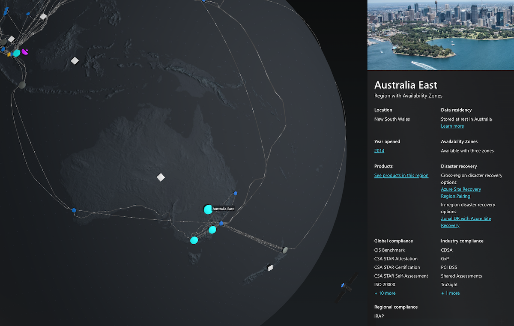

It is recommended to deploy Microsoft Sentinel in the **Australia East** region. If you have not already done so, you can follow the steps below:

- [Create a Log Analytics Workspace](https://docs.microsoft.com/en-us/azure/azure-monitor/logs/quick-create-workspace)
- [Enable Microsoft Sentinel](https://docs.microsoft.com/en-us/azure/sentinel/quickstart-onboard#enable-microsoft-sentinel-)

If you have Log Analytics setup in another region, it is recommended to [move it to Australia East](https://docs.microsoft.com/en-us/azure/azure-monitor/logs/move-workspace-region) where possible, as query performance is reduced when spanning multiple regions, and the majority of existing deployments are in Australia East.

## 2. High value / low-cost connections

These connectors are largely built into the cost of the services they protect, and provide a high value in terms of assets protected. Some additional context is provided on how to best configure and onboard devices and services, however only **the emphasised steps** need to be completed to establish a baseline SIEM environment.

### 2.1. [Connect Azure Active Directory (Azure AD)](https://docs.microsoft.com/en-us/azure/sentinel/connect-azure-active-directory)

Ensure that Identity management activities are picked up, including [Audit logs, Sign-in logs, Provisioning logs, Risky users logs, Risk detections logs](https://docs.microsoft.com/en-us/azure/active-directory/reports-monitoring/howto-integrate-activity-logs-with-log-analytics#send-logs-to-azure-monitor)

### 2.2. [Turn on Microsoft 365 Defender](https://docs.microsoft.com/en-us/microsoft-365/security/defender/m365d-enable?view=o365-worldwide)

This includes Office 365, Endpoint, Identity and Cloud Apps

#### 2.2.1. [Protect against Threats using Defender for Office 365](https://docs.microsoft.com/en-us/microsoft-365/security/office-365-security/protect-against-threats?view=o365-worldwide)

Align with the [ACSC Essential Eight Maturity Model](https://www.cyber.gov.au/acsc/view-all-content/publications/essential-eight-maturity-model)

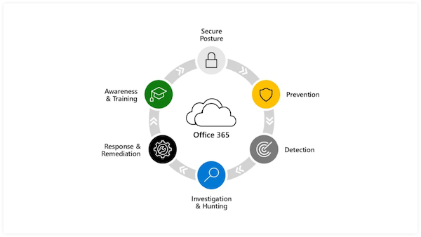

- Start with [Microsoft Defender for Office 365 step-by-step guides](https://docs.microsoft.com/en-us/microsoft-365/security/office-365-security/step-by-step-guides/step-by-step-guide-overview?view=o365-worldwide) if unfamiliar with the Defender for Office 365 platform
- Use Exchange Online and SharePoint Online for all staff email & file services
- [Integrate with Defender for Endpoint](https://docs.microsoft.com/en-us/microsoft-365/security/office-365-security/integrate-office-365-ti-with-mde?view=o365-worldwide)

#### 2.2.2. [Configure Microsoft Defender for Endpoint in Intune](https://docs.microsoft.com/en-us/mem/intune/protect/advanced-threat-protection-configure)

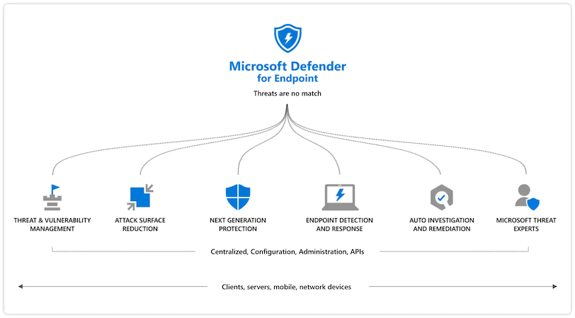

- Use Intune for endpoint management and mobile device management
- Windows, macOS and Linux servers should also be onboarded into Microsoft 365 Defender for Endpoint unless they are separately sending the above data to Sentinel via another connector (e.g. [Microsoft Defender for Cloud](https://docs.microsoft.com/en-us/azure/sentinel/connect-defender-for-cloud) or [Container Insights](https://docs.microsoft.com/en-us/azure/azure-monitor/containers/container-insights-overview))
- [Windows devices in Defender for Endpoint](https://docs.microsoft.com/en-us/microsoft-365/security/defender-endpoint/configure-endpoints?view=o365-worldwide) - Windows 7+, Windows Server 2008 R2+
- [Defender for Endpoint on Mac](https://docs.microsoft.com/en-us/microsoft-365/security/defender-endpoint/microsoft-defender-endpoint-mac?view=o365-worldwide) - macOS 10.15+ (Catalina)
- [Defender for Endpoint on Linux](https://docs.microsoft.com/en-us/microsoft-365/security/defender-endpoint/microsoft-defender-endpoint-linux?view=o365-worldwide) - Debian 9+, Ubuntu 16.04+, RHEL6+, SLES12+, CentOS6+, OEL7+, Fedora33+
- Align with the [ACSC Strategies to Mitigate Cyber Security Incidents](https://www.cyber.gov.au/acsc/view-all-content/publications/strategies-mitigate-cyber-security-incidents) by moving endpoints to [Windows cloud configuration](https://docs.microsoft.com/en-us/mem/intune/fundamentals/cloud-configuration) which includes [Security Baseline for Windows](https://docs.microsoft.com/en-us/mem/intune/protect/security-baseline-settings-mdm-all), then [configure WDAC policy for Application Control](https://docs.microsoft.com/en-us/windows/security/threat-protection/windows-defender-application-control/wdac-wizard-create-base-policy), [Defender for Endpoint Baseline](https://docs.microsoft.com/en-us/mem/intune/protect/security-baseline-settings-defender-atp) and [Edge Baseline](https://docs.microsoft.com/en-us/mem/intune/protect/security-baseline-settings-edge).

This is the lowest cost way per device to get baseline monitoring in place.

#### 2.2.3. [Install Identity Sensors](https://docs.microsoft.com/en-us/microsoft-365/security/defender-identity/sensor-health?view=o365-worldwide#add-a-sensor)

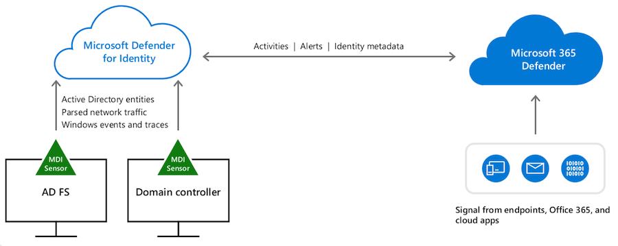

Install on all domain controllers and ADFS servers

- This is only relevant where on-premise Active Directory syncs to Azure AD, if entirely using Azure AD this is not required
- [Configure RADIUS Accounting on 802.1X networks & VPNs](https://docs.microsoft.com/en-us/microsoft-365/security/defender-identity/vpn-integration?view=o365-worldwide) - Capture 802.1X events via RADIUS accounting traffic forwarded to Identity Sensors (VPNs, wireless, 802.1X ports)

#### 2.2.4. [Integrate Defender for Cloud Apps](https://docs.microsoft.com/en-us/defender-cloud-apps/mde-integration)

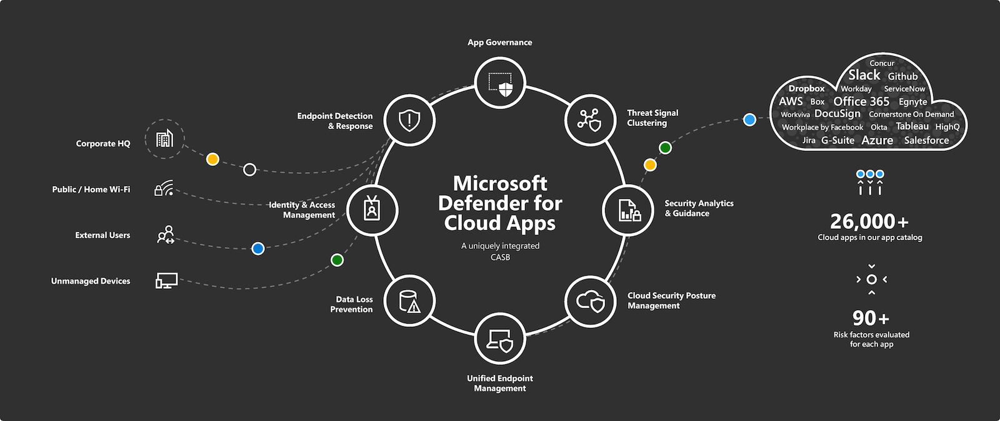

#### 2.2.5. [Connect Microsoft 365 Defender](https://docs.microsoft.com/en-us/azure/sentinel/connect-microsoft-365-defender?tabs=MDE#connect-to-microsoft-365-defender)

Collect events from [Defender for Office 365](https://docs.microsoft.com/en-us/microsoft-365/security/office-365-security/defender-for-office-365?view=o365-worldwide#getting-started) and Defender for Endpoint

- Enable collection of events from all Advanced Hunting tables (Defender, Office 365, Identity, Cloud Apps & Alerts)

### 2.3. [Connect Azure Activity log](https://docs.microsoft.com/en-us/azure/azure-monitor/essentials/activity-log#send-to-log-analytics-workspace)

Ensure all azure activity is logged and retained.

### 2.4. [Ingest WAF events into Sentinel](https://docs.microsoft.com/en-us/azure/web-application-firewall/waf-sentinel)

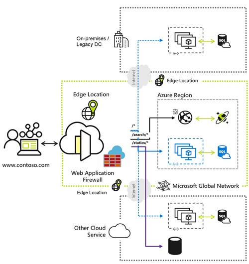

WAF events are a high quality security event source for monitoring ingress to applications. Third party WAF integration options are listed on [the Sentinel content hub](https://docs.microsoft.com/en-us/azure/sentinel/sentinel-solutions-catalog)

### 2.5. [Review the Sentinel content hub](https://docs.microsoft.com/en-us/azure/sentinel/sentinel-solutions-catalog)

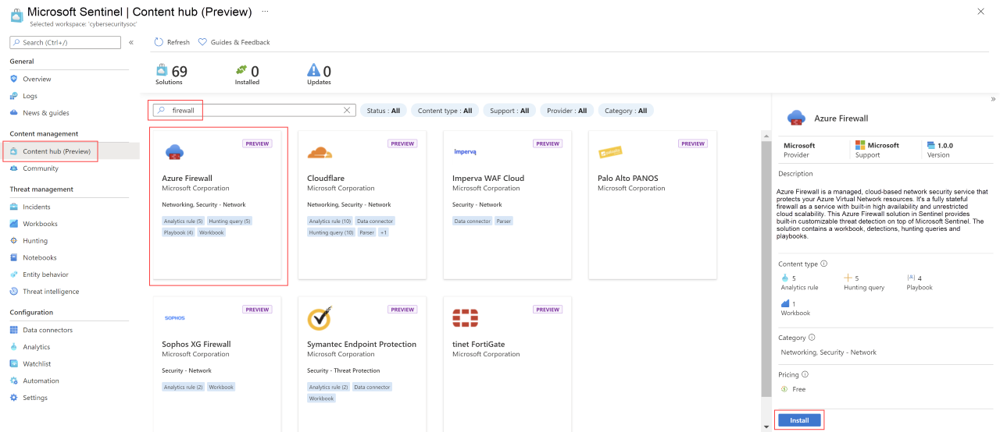

Check and enable security relevant connections to other services or products your organisation is using.

## 3. Complex connections

These are good for querying manually, however most require some work to [Normalise using the Advanced Security Information Model (ASIM)](https://docs.microsoft.com/en-us/azure/sentinel/normalization) to be incorporated into automatic incident generation using standard Sentinel rules.

1. [AWS S3 Connector](https://docs.microsoft.com/en-us/azure/sentinel/connect-aws?tabs=s3) - This collects data via S3 buckets so has some delays compared to higher level integrations like [Microsoft 365 Defender](https://docs.microsoft.com/en-us/azure/sentinel/connect-microsoft-365-defender) or [Container Insights](https://docs.microsoft.com/en-us/azure/azure-monitor/containers/container-insights-overview)
1. [Logstash to connect data sources to Microsoft Sentinel](https://docs.microsoft.com/en-us/azure/sentinel/connect-logstash) - For third party platforms without microsoft documented connection guidance, this is the best integration option.
1. [CEF-formatted logs from your device or appliance](https://docs.microsoft.com/en-us/azure/sentinel/connect-common-event-format)
1. [Linux-based sources using Syslog](https://docs.microsoft.com/en-us/azure/sentinel/connect-syslog)

## 4. Potentially high-cost connections

1. [Container Insights](https://docs.microsoft.com/en-us/azure/azure-monitor/containers/container-insights-overview) - Centrally monitor [Kubernetes cluster performance](https://docs.microsoft.com/en-us/azure/azure-monitor/containers/container-insights-analyze) and [query logs](https://docs.microsoft.com/en-us/azure/azure-monitor/containers/container-insights-log-query)
1. [Microsoft Defender for Cloud](https://docs.microsoft.com/en-us/azure/sentinel/connect-defender-for-cloud) - If possible [Enable all Microsoft Defender plans](https://docs.microsoft.com/en-us/azure/defender-for-cloud/enable-enhanced-security#enable-enhanced-security-features-from-the-azure-portal) for your high value systems (such as Domain Controllers and SQL Databases, approx. 2-3% of total servers usually)

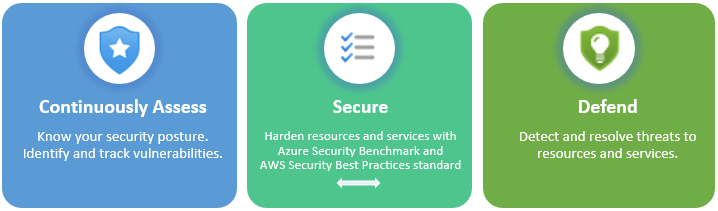

### 4.1. Operational Technology Monitoring

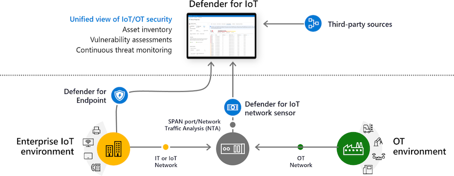

Use [Microsoft Defender for IoT/OT](https://docs.microsoft.com/en-us/azure/defender-for-iot/organizations/tutorial-onboarding) for passive network monitoring for devices not supported by Defender for Endpoint/Cloud via TAP/packet broker (previously [CyberX](https://www.microsoft.com/security/blog/2020/11/25/go-inside-the-new-azure-defender-for-iot-including-cyberx/)), this is a very high quality egress monitoring event source. Microsoft makes significant volume discounts available.

- To manage costs it is recommended to use policy based routing or L3 segmentation to separate your endpoint traffic from OT devices, and utilise a packet broker to push OT traffic into the OT sensor, enterprise firewall packet broker config guides are listed below:
  - Firewalls (best option): [Palo Alto Packet Broker](https://docs.paloaltonetworks.com/pan-os/10-1/pan-os-networking-admin/network-packet-broker), [Checkpoint Mirror and Decrypt](https://sc1.checkpoint.com/documents/R81/WebAdminGuides/EN/CP_R81_NextGenSecurityGateway_Guide/Topics-FWG/Mirror-and-Decrypt.htm)
  - Switches: [Cisco SPAN](https://www.cisco.com/c/en/us/support/docs/switches/catalyst-6500-series-switches/10570-41.html), [Cisco Meraki Port Mirror](https://documentation.meraki.com/MS/Monitoring_and_Reporting/Packet_Captures_and_Port_Mirroring_on_the_MS_Switch), [Fortinet SPAN](https://docs.fortinet.com/document/fortiswitch/7.0.1/administration-guide/428704/mirror)
  - A scalable architecture supporting SD-WAN's would be using IPSEC to route OT egress traffic via a public cloud provider ([Azure Site to Site](https://docs.microsoft.com/en-us/azure/vpn-gateway/tutorial-site-to-site-portal), [AWS Site to Site](https://docs.aws.amazon.com/vpn/latest/s2svpn/VPC_VPN.html)) and then monitor the egress using a cloud firewall supporting packet brokering (e.g. [Palo Alto VM Series](https://www.paloaltonetworks.com.au/cloud-security/vm-series)) to a sensor hosted on the public cloud environment itself.
- If passively monitoring over 1K devices using a per Gbps metric sensor such as [Corelight](https://corelight.com/integrations/iot-security) may be a more cost effective option

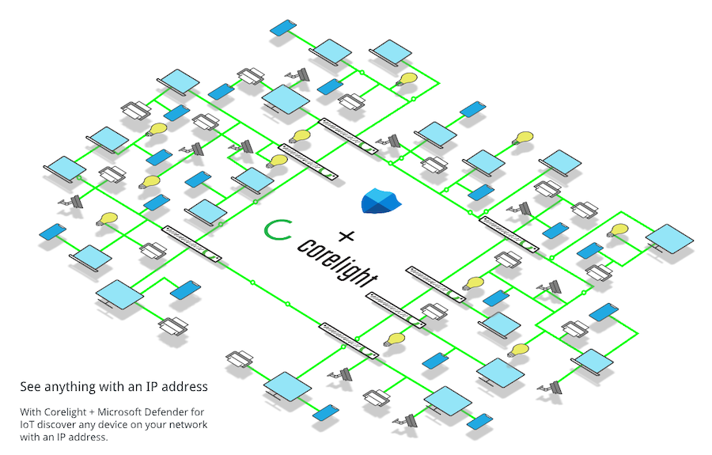
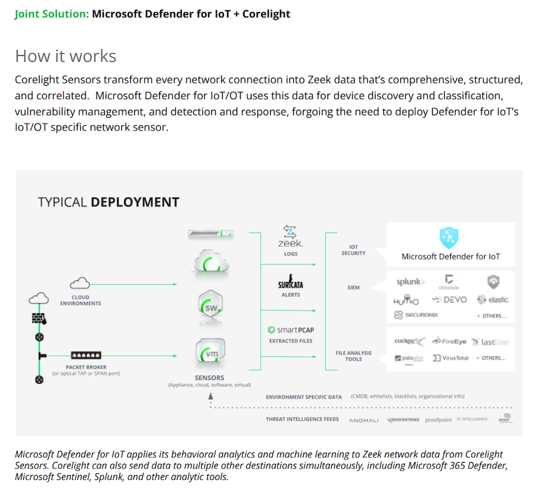

## 5. Cost optimisation

Microsoft Sentinel has builtin [queries to understand your data ingestion](https://docs.microsoft.com/en-us/azure/sentinel/billing-monitor-costs#run-queries-to-understand-your-data-ingestion) at a per table level. To get further granularity you can look at specific devices sending a lot of data using [additional usage queries](https://docs.microsoft.com/en-us/azure/azure-monitor/logs/log-analytics-workspace-insights-overview#additional-usage-queries) or directly run manual queries from [Investigate your Log Analytics usage](https://docs.microsoft.com/en-us/azure/azure-monitor/logs/manage-cost-storage#investigate-your-log-analytics-usage).

Once you have identified the high cost items, you can reduce the events generated at the source, using a [Logstash filter](https://docs.microsoft.com/en-us/azure/sentinel/connect-logstash) for a custom source or with configuration in Sentinel itself:

- [Ingestion time transformations](https://docs.microsoft.com/en-us/azure/azure-monitor/logs/ingestion-time-transformations) - should be used to eliminate low value logs before they are persisted within Log Analytics & Sentinel
- [Basic Logs](https://docs.microsoft.com/en-us/azure/azure-monitor/logs/basic-logs-configure?tabs=cli-1%2Cportal-1) - should be used for high volume tables that aren't queried regularly (approx 1/4 cost per GB ingested)
